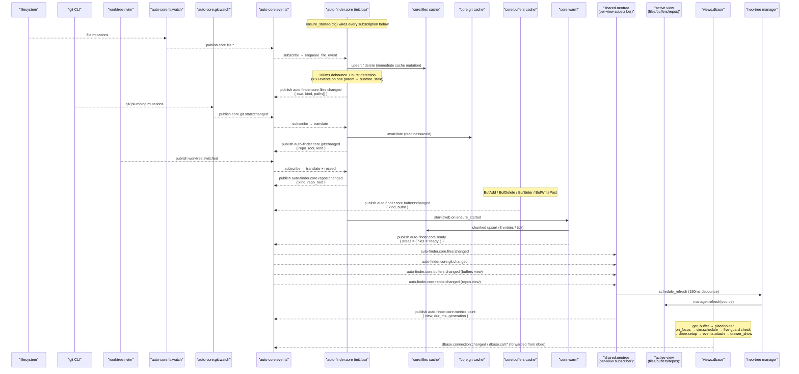

# auto-finder.nvim — architecture

This document describes the plugin's internal structure as of the
ADR 0026 refactor arc (Phases 1–8 shipped on the `core-skeleton`
branch). It is meant for contributors who need to navigate the
code; users only need `README.md`.

The canonical design rationale lives in
[`shared/adrs/0026-auto-finder-state-ui-separation.md`](https://git.johnosoft.org/knowledge-base/global-kb)
of the project KB. This document is the post-implementation
summary — what shipped, how the pieces talk to each other, and
which surfaces are stable vs. transitional.

## Contents

- [Top-level layout](#top-level-layout)
- [System architecture diagram](#system-architecture)
- [Module catalog](#module-catalog)
- [Event flow diagram](#event-flow--pubsub-with-auto-core)
- [auto-core dependency surface](#auto-core-dependency-surface)
- [Lifecycle](#lifecycle)
- [Versioning policy](#versioning-policy)
- [Pointers for new work](#pointers-for-new-work)

---

## Top-level layout

```
lua/auto-finder/
├── init.lua                  public API (setup / open / close / focus / resize)
├── config.lua                config schema, validation, width resolution
├── state.lua                 persistent UI state via auto-core.state.namespace
├── log.lua                   auto-core.log shim (component prefix "auto-finder.*")
├── _storage.lua              legacy JSON store (files filter prefs only)
│
├── core/                     runtime state component (single source of truth)
│   ├── init.lua              core.ensure_started / stop / reload / is_started
│   ├── events.lua            auto-finder.core.* topic registry + pub/sub
│   ├── files.lua             directory-aware file tree cache
│   ├── git.lua               git status denormalized view (auto-core.git.status)
│   ├── buffers.lua           buffer-list cache (Buf* autocmd driven)
│   ├── repos.lua             repos registry view (auto-finder.repos / worktree.nvim)
│   ├── watchers.lua          fs.watch + git.watch handle owner
│   └── warm.lua              chunked async tree warmer
│
├── views/                    UI view modules; each is a renderer
│   ├── init.lua              view registry (load / setup / resolve / active)
│   ├── config/init.lua       control surface (prompt REPL)
│   ├── files/init.lua        neo-tree filesystem source wrapper
│   ├── buffers/init.lua      neo-tree buffers source wrapper
│   ├── repos/init.lua        auto-finder-repos source wrapper
│   └── dbase/                nvim-dbee drawer wrapper (multi-file: init, setup, events, layout, files)
│
├── sections/                 backwards-compat facade (one-liners → views/*)
│
├── shared/                   pure helpers, no UI state of their own
│   ├── neotree.lua           neo-tree mount + lifecycle helpers
│   ├── loading.lua           generation-tagged placeholder buffer factory
│   ├── window.lua            is_any_panel / is_auto_finder_panel predicates
│   ├── view_subs.lua         per-view subscription set with replace-or-add
│   └── debounce.lua          coalesce helper (generation-counter cancel)
│
├── panel/
│   ├── host.lua              owns the panel window (vsplit, winfixwidth, winfixbuf)
│   ├── admin.lua             config-view REPL implementation
│   └── wizard.lua            first-run setup wizard
│
├── repos.lua                 thin facade over worktree.nvim for repo discovery
├── neotree.lua               thin wrapper that calls into the fork below
└── neotree/                  VENDORED neo-tree.nvim fork (3rd-party code; do not refactor)
```

Internal callers use direct paths (`auto-finder.core.files`,
`auto-finder.views.files`, `auto-finder.shared.neotree`). The
`sections/` tree is preserved as a one-line facade re-exporting
from `views/*` for any third-party consumer pinned to the older
`auto-finder.sections.<name>` namespace through `v0.2.x`.

---

## System architecture

```mermaid
flowchart TB
    %% =========================
    %% USER & API
    %% =========================
    USER([User])
    CMD["nvim commands<br/>:AutoFinder*<br/>require('auto-finder').setup/open/focus/resize"]
    USER --> CMD

    %% =========================
    %% PUBLIC API LAYER
    %% =========================
    subgraph PUBLIC ["Public API (auto-finder)"]
        direction TB
        INIT["init.lua<br/>setup/open/close/toggle/focus/resize"]
        CONFIG["config.lua<br/>schema · validate · apply"]
        STATE["state.lua<br/>persistent UI prefs"]
        LOG["log.lua<br/>auto-core.log shim"]
    end
    CMD --> INIT
    INIT --> CONFIG
    INIT --> STATE
    INIT --> LOG

    %% =========================
    %% CORE (RUNTIME STATE)
    %% =========================
    subgraph CORE ["core/ (runtime state - single source of truth)"]
        direction LR
        COREINIT["init.lua<br/>ensure_started · stop · reload"]
        CEVENTS["events.lua<br/>auto-finder.core.* topics<br/>publish/subscribe"]
        CFILES["files.lua<br/>directory-aware cache"]
        CGIT["git.lua<br/>git status view"]
        CBUF["buffers.lua<br/>buffer list cache"]
        CREPOS["repos.lua<br/>repos registry view"]
        CWATCH["watchers.lua<br/>fs.watch + git.watch handle owner"]
        CWARM["warm.lua<br/>chunked tree warmer"]

        COREINIT --> CEVENTS
        COREINIT --> CWATCH
        COREINIT --> CWARM
        CFILES <-.cache.-> CWARM
        CWATCH -.handles.-> CFILES
        CWATCH -.handles.-> CGIT
        CBUF -.autocmds.-> COREINIT
    end
    INIT -- "ensure_started(cfg)" --> COREINIT

    %% =========================
    %% VIEWS (UI RENDERERS)
    %% =========================
    subgraph VIEWS ["views/ (UI renderers)"]
        direction LR
        VREG["init.lua<br/>registry · active()"]
        VCONFIG["config/<br/>prompt REPL"]
        VFILES["files/<br/>filesystem"]
        VBUF["buffers/<br/>open buffers"]
        VREPOS["repos/<br/>git worktrees"]
        VDBASE["dbase/<br/>nvim-dbee drawer<br/>(placeholder mount)"]

        VREG -.loads.-> VCONFIG
        VREG -.loads.-> VFILES
        VREG -.loads.-> VBUF
        VREG -.loads.-> VREPOS
        VREG -.loads.-> VDBASE
    end

    %% =========================
    %% SHARED HELPERS
    %% =========================
    subgraph SHARED ["shared/ (pure helpers)"]
        direction LR
        SNEO["neotree.lua<br/>mount + build_section"]
        SLOAD["loading.lua<br/>placeholder factory"]
        SWIN["window.lua<br/>panel predicates"]
        SSUBS["view_subs.lua<br/>subscription sets"]
        SDEB["debounce.lua<br/>coalesce(fn, ms)"]
    end
    VFILES --> SNEO
    VBUF --> SNEO
    VREPOS --> SNEO
    VDBASE --> SLOAD
    SNEO --> SDEB
    COREINIT --> SDEB

    %% =========================
    %% PANEL (WINDOW HOST)
    %% =========================
    subgraph PANEL ["panel/ (window host)"]
        direction LR
        PHOST["host.lua<br/>vsplit · winfixwidth/winfixbuf<br/>with_unfixed_buf"]
        PADMIN["admin.lua<br/>REPL backend (for views/config)"]
    end
    INIT --> PHOST
    VCONFIG --> PADMIN

    %% =========================
    %% NEO-TREE FORK
    %% =========================
    NEOFORK["neotree/ (vendored neo-tree fork)<br/>filesystem + buffers + auto-finder-repos sources"]
    SNEO -.executes.-> NEOFORK

    %% =========================
    %% AUTO-CORE DEPENDENCY
    %% =========================
    subgraph AUTOCORE ["auto-core.nvim (soft-dep, plugin-level)"]
        direction LR
        ACEVT["events<br/>publish/subscribe bus"]
        ACFS["fs.watch<br/>libuv fs_event wrapper"]
        ACGITW["git.watch<br/>.git/ plumbing watcher"]
        ACGITS["git.status<br/>porcelain cache"]
        ACSTATE["state<br/>namespace persistence"]
        ACPANEL["ui.panel<br/>panel primitive"]
        ACSECTION["ui.section<br/>section registry"]
        ACLOG["log<br/>ring + notify"]
    end
    LOG --> ACLOG
    STATE --> ACSTATE
    PHOST --> ACPANEL
    INIT -.wraps views into.-> ACSECTION
    CEVENTS --> ACEVT
    CWATCH --> ACFS
    CWATCH --> ACGITW
    CGIT --> ACGITS

    %% =========================
    %% EVENT FLOW (DASHED)
    %% =========================
    ACEVT -. "core.file:*<br/>core.git.state:changed<br/>worktree:switched" .-> COREINIT
    COREINIT -. "auto-finder.core.*<br/>files/git/buffers/repos/ready/metrics:paint" .-> ACEVT
    ACEVT -. "auto-finder.core.*" .-> SNEO
    ACEVT -. "auto-finder.core.*" .-> VDBASE

    classDef public fill:#e8f0ff,stroke:#5a78b3,stroke-width:1px;
    classDef core fill:#e3f7e3,stroke:#3a7a3a,stroke-width:1px;
    classDef views fill:#fff4d6,stroke:#a08020,stroke-width:1px;
    classDef shared fill:#f0e6ff,stroke:#7050b0,stroke-width:1px;
    classDef panel fill:#ffe3e3,stroke:#a04040,stroke-width:1px;
    classDef autocore fill:#d6f0f5,stroke:#3080a0,stroke-width:1px;
    classDef neo fill:#f5f5f5,stroke:#888,stroke-width:1px;

    class INIT,CONFIG,STATE,LOG public;
    class COREINIT,CEVENTS,CFILES,CGIT,CBUF,CREPOS,CWATCH,CWARM core;
    class VREG,VCONFIG,VFILES,VBUF,VREPOS,VDBASE views;
    class SNEO,SLOAD,SWIN,SSUBS,SDEB shared;
    class PHOST,PADMIN panel;
    class ACEVT,ACFS,ACGITW,ACGITS,ACSTATE,ACPANEL,ACSECTION,ACLOG autocore;
    class NEOFORK neo;
```



### Reading the diagram

- **Solid arrows** are direct module dependencies (require / call).
- **Dotted arrows with labels** are event-bus subscriptions or
  cache-handle relationships.
- The four colored groups are the architectural tiers:
  - **Public API** — the only surface `init.lua` external callers
    touch.
  - **`core/`** — single source of truth for runtime state.
    Everything that needs to know "what does the file tree look
    like right now?" reads from here.
  - **`views/`** — pure renderers. They subscribe to
    `auto-finder.core.*` topics and render against
    `core.<area>.snapshot_now()`. They do **not** subscribe to
    upstream `auto-core.*` topics directly (A1 acceptance).
  - **`shared/`** — pure helpers (no state, no UI).
- **`auto-core.nvim`** is a soft-dep at the plugin level; every
  auto-core surface auto-finder uses is wrapped in a `pcall`
  loadability check so the plugin degrades gracefully when
  auto-core isn't installed (with the obvious UX caveats — no
  live refresh, no panel singleton, no log ring).

---

## Module catalog

### Public API — `lua/auto-finder/`

| Module | Role |
|---|---|
| `init.lua` | Public surface. `setup` wires `config`, `state`, `log`, the panel host, `core.ensure_started`, and the `auto-core.ui.section` registry against the loaded views. |
| `config.lua` | Config schema (width, default_section, sections, view_modules + legacy section_modules alias, per-view opts). `apply` validates + merges defaults; `resolve_width` clamps to `[min..max]`. |
| `state.lua` | Persistent UI state via `auto-core.state.namespace("auto-finder", { persist = "json" })`. Tracks `user_width` (resize pin), `last_section`, per-project section composition. |
| `log.lua` | Single-file logging shim per ADR 0021 §6. All plugin code calls into `auto-finder.log`; never `require("auto-core").log` directly. |
| `_storage.lua` | Legacy JSON store, now only carries `files.*` filter prefs that haven't migrated to a namespace key yet. |

### `core/` — runtime state component

Single source of truth for the file tree, git status, buffer list,
repo registry, worktree state. Subscribes to auto-core events on
`ensure_started`, maintains caches, publishes
`auto-finder.core.*` topics.

| Module | Role |
|---|---|
| `core/init.lua` | Lifecycle: `ensure_started(cfg)` is idempotent; `stop()` disposes everything. Owns the per-topic subscription handles and the file-event debounce coalescer (via `shared.debounce`). Translates upstream `core.file:*` → `auto-finder.core.files:changed` with burst detection (`>50` events on one parent within `200ms` → `subtree_stale`). |
| `core/events.lua` | Topic registry (six topics) + thin pub/sub wrappers over `auto-core.events`. Single swap point if a local emitter is ever needed. |
| `core/files.lua` | Directory-aware sparse cache. File entries `{ kind='file', path, stat, git_status, gitignored, generation }`; directory entries `{ kind='directory', path, children, children_state='cold'\|'known'\|'stale', generation }`. `snapshot_now` is cheap; `snapshot_async` waits for `auto-finder.core.ready`. |
| `core/git.lua` | Denormalized view over `auto-core.git.status`. Converts porcelain entries to `by_path[abs] = { x, y, code }`. Lazy-populated on `snapshot_now`. |
| `core/buffers.lua` | Buf*-autocmd-driven cache. Mirrors `:ls` (listed + unloaded). Augroup re-armed on every `ensure_started`. |
| `core/repos.lua` | Thin denormalized view over `auto-finder.repos` (which is itself a thin facade over `worktree.nvim`). Cache invalidated on `auto-finder.core.repos:changed`. |
| `core/watchers.lua` | Owns every libuv-backed watcher (fs.watch + git.watch). `open_for(cwd)` opens both; `close_all()` releases everything. Handle-cap degradation per ADR §2.6: warn log + flip files readiness to `'partial'`. |
| `core/warm.lua` | Chunked top-level walker. 8 entries per `vim.schedule`'d tick. Per-tick durations tracked for A15 (≤ 5ms per tick). Publishes `auto-finder.core.ready` on completion. |

### `views/` — UI renderers

| View | Implementation | Notes |
|---|---|---|
| `config` | REPL via `panel/admin.lua` | Slot 0 — control surface. |
| `files` | `shared.neotree.build_section({ source = "filesystem" })` | Live-refresh via `auto-finder.core.files:changed`. Synchronous mount (see `views/` notes below). |
| `buffers` | `shared.neotree.build_section({ source = "buffers", core_refresh_topic = "auto-finder.core.buffers:changed" })` | Buf*-event-driven refresh. |
| `repos` | `shared.neotree.build_section({ source = "auto-finder-repos", core_refresh_topic = "auto-finder.core.repos:changed" })` | Refresh on worktree switch. |
| `dbase` | Bespoke multi-file (`init`, `setup`, `events`, `layout`, `files`) | **Uses the placeholder mount pattern** — `get_buffer` returns a `shared.loading.buffer` synchronously; `on_focus` defers `dbee.setup` + `drawer_show` via `vim.schedule` behind the five-guard `_still_current` predicate. Only view doing this; see ADR §A16. |

The five-guard `_still_current` predicate (ADR §2.3) lives in
`shared/neotree.lua`'s `build_section` as scaffolding —
neo-tree-backed views currently use the synchronous mount path
because of an auto-core Registry keymap-binding tension
(documented in `tests/auto-finder-test-audit.md` F7.1). The
scaffolding is in place so a future auto-core change can flip
those views to the placeholder pattern without structural rework.

### `shared/` — pure helpers

| Module | Role |
|---|---|
| `shared/neotree.lua` | `build_section(opts)` mounts a neo-tree source into the panel via `position = "current"`. Owns `schedule_refresh` (debounced 150ms), the `?` help-overlay keymap install, and the `_arm_live_refresh_subs` subscription wiring. |
| `shared/loading.lua` | Generation-tagged placeholder factory. `nofile` + `bufhidden=wipe` + readonly buffer with "Loading <view>…". `is_placeholder` / `matches` predicates for the five-guard check. |
| `shared/window.lua` | `is_any_panel(winid)` (broad exclusion) + `is_auto_finder_panel(winid)` (narrow lookup). Per [[auto-core-panel-ownership]]'s asymmetric contract. |
| `shared/view_subs.lua` | `view_subs.new()` returns a set with `replace(slot, topic, cb)` semantics so re-running `on_focus` doesn't duplicate callbacks. |
| `shared/debounce.lua` | `coalesce(fn, ms)` returns `(trigger, cancel)`. Uses a generation counter rather than timer cancellation because `vim.defer_fn` returns nil (see audit-log F8.1). |

### `panel/` — window host

| Module | Role |
|---|---|
| `panel/host.lua` | Owns the panel window (vsplit on the left, `winfixwidth=true`, `winfixbuf=true`). `with_unfixed_buf(winid, fn)` temporarily lifts `winfixbuf` so internal buffer swaps don't trip the guard. |
| `panel/admin.lua` | Prompt REPL backing the `config` view. Verb dispatch, history, completion. |
| `panel/wizard.lua` | First-run setup wizard. |

---

## Event flow / pub-sub with auto-core



### Topics published by `core/` (auto-finder-private)

| Topic | Payload | Consumers |
|---|---|---|
| `auto-finder.core.files:changed` | `{ cwd, kind = 'upsert'\|'delete'\|'subtree_stale', paths[], parents[] }` | `files` view (via shared.neotree); future render-from-snapshot consumers |
| `auto-finder.core.git:changed` | `{ repo_root, kind, paths? }` | `files` view (decorators) |
| `auto-finder.core.buffers:changed` | `{ kind = 'add'\|'remove'\|'enter'\|'modify', bufnr }` | `buffers` view |
| `auto-finder.core.repos:changed` | `{ kind, repo_root }` | `repos` view; `core.repos` cache (invalidates) |
| `auto-finder.core.ready` | `{ areas = { files = 'ready'\|'partial', … } }` | `core.files.snapshot_async`; future "warming…" UI badges |
| `auto-finder.core.metrics:paint` | `{ view, dur_ms, generation, paths_count? }` | A5 baseline + post-refactor smoke; future telemetry |

### Topics consumed by `core/` (upstream auto-core)

| Topic | Translated to | Source |
|---|---|---|
| `core.file:created` / `core.file:modified` | `auto-finder.core.files:changed` (kind='upsert') | `auto-core.fs.watch` |
| `core.file:deleted` | `auto-finder.core.files:changed` (kind='delete') | `auto-core.fs.watch` |
| `core.git.state:changed` | `auto-finder.core.git:changed` + drop `core.git` readiness | `auto-core.git.watch` (per ADR 0025) |
| `worktree:switched` | `auto-finder.core.repos:changed` + `M._reseed_sections_for_workspace` + `M._drop_repos_bufnr_on_worktree_switched` | `worktree.nvim` |
| `core.workspace_root:changed` | reseed only | `worktree.nvim` |
| `state.auto-finder:user_width:changed` | mirrors to `M.state.user_width` + panel resize | `auto-core.state.namespace` |
| `state.auto-finder:last_section:changed` | mirrors to `M.state.section` | `auto-core.state.namespace` |

All subscriptions live inside `core.ensure_started(cfg)` per
[[auto-core-events-subscription-lifecycle]] — no load-bearing
module-load subscribes. Bus reset survives via unconditional
dispose-first-then-resubscribe (ADR §2.2 contract).

---

## auto-core dependency surface

auto-finder is a **soft-dep consumer** of auto-core — every
surface listed below is wrapped in a `pcall` loadability check
at the auto-finder side. The plugin runs (with reduced
functionality) when auto-core isn't installed.

| auto-core surface | auto-finder consumer | What it provides |
|---|---|---|
| `auto-core.events` | `core/events.lua` (wrapper), `core/init.lua` (subscriptions), all `auto-finder.core.*` publishes | Pub/sub bus. Single transport for both upstream + private topics. |
| `auto-core.fs.watch` | `core/watchers.lua::open_for/close_for` | Recursive libuv `fs_event` wrapper. Publishes `core.file:*`. |
| `auto-core.git.watch` | `core/watchers.lua::open_for/close_for` | `.git/` plumbing watcher (ADR 0025). Publishes `core.git.state:changed`. Soft-dep on auto-core ≥ v0.1.19. |
| `auto-core.git.status` | `core/git.lua::snapshot_now`, `core.git.invalidate` | Cached `git status --porcelain=v1` per repo. auto-finder denormalizes into path-keyed shape. |
| `auto-core.state` | `state.lua` | Namespace persistence (`auto-finder.json` in `stdpath("state")`). |
| `auto-core.ui.panel` | `panel/host.lua` | Panel primitive — vsplit + winfixwidth/winfixbuf marker stamping. |
| `auto-core.ui.section` | `init.lua` (registry wrapper) | Section registry. Wraps each `views/<name>` into its `AutoCoreSectionDef` shape. Binds `0..9` + `q`-close keymaps on each section buffer. |
| `auto-core.log` | `log.lua` (shim) | Ring buffer + level filter + toast routing via `notify` / `notifyIf`. |
| `auto-core.git.worktree` | `repos.lua::root`, `_workspace_key`, the reseed path | Workspace root detection + worktree enumeration. |
| `worktree.nvim` (indirect via auto-core) | `repos.lua::load` | Repo discovery under the workspace root. |

The boundary is enforced in two directions:

- **auto-finder does not write into auto-core's internals.** Every
  read is via a public function; every write (e.g.
  `auto-core.git.status.invalidate`) goes through a documented
  surface.
- **auto-core does not know about auto-finder.** Bus topics are
  consumer-routed; no auto-core code references
  `auto-finder.*` symbols.

---

## Event detection + processing

This section walks through every category of event auto-finder
observes — how each is detected at the OS / nvim layer, how it
flows up through auto-core, how `core/` processes it, and what
the views ultimately see.

### 1. Filesystem mutations

**Detection — `auto-core.fs.watch`** wraps libuv's `fs_event`
primitive into a recursive watcher rooted at a cwd. On `start`
it walks the directory tree and opens one `fs_event` handle per
subdirectory (capped by `cfg.max_handles`, default 1024 per
session). Each `fs_event` callback fires whenever the kernel
notifies a change inside its watched directory (inotify on
Linux, FSEvents on macOS, ReadDirectoryChangesW on Windows).

auto-core publishes three discrete topics off this stream:

- `core.file:created` — entry appeared in a watched directory
  (the libuv event reports `rename` and a fresh `fs_stat`
  succeeds).
- `core.file:modified` — content changed in place (the libuv
  event reports `change`).
- `core.file:deleted` — entry vanished (the libuv event
  reports `rename` and `fs_stat` returns no such file).

**Payload shape:** `{ path: string, change: 'created'|'modified'|'deleted' }`.

**Detection limits worth knowing about:**

- The recursive walk happens at `start` time only. **New
  directories created after start are NOT auto-extended into
  the watch tree** (`auto-core/fs/watch.lua:21-28`). Events
  inside a fresh dir won't fire until either the user causes a
  re-walk via `core.reload()` or auto-core ships a re-extend
  hook.
- libuv's `fs_event` classifies `rename-with-stat` as "created"
  and `rename-without-stat` as "deleted." It does **not**
  surface paired old→new rename events. `mv old new` arrives as
  two unrelated events. ADR §2.5 documents this and Phase 4's
  cache responds with `subtree_stale` invalidation rather than
  attempting file-event reassembly.
- macOS's FSEvents backend is known to drop rename/delete
  events in rapid-burst scenarios. The user-visible symptom is
  the files panel needing manual `R` to pick up an external
  `mv` / `rm`. This is filed against auto-core for a darwin
  reliability fix (see project KB synthesis
  `auto-core-fs-event-macos-reliability.md`); auto-finder does
  not patch this from its side.
- `auto-core.fs.watch`'s `DEFAULT_IGNORE` excludes `/.git/`
  paths from publishing — the .git/-plumbing watcher
  (`auto-core.git.watch`, see §2 below) owns that surface
  specifically.

**Processing — `core/init.lua` translator:**

```
core.file:* event
   │
   ├─ enqueue_file_event(path, kind)
   │     │
   │     ├─ files_mod.upsert(path) | .delete(path)
   │     │   (IMMEDIATE cache mutation; `get(path)` reflects
   │     │    reality even mid-debounce)
   │     │
   │     └─ append to _file_buf; trigger debounce.coalesce
   │
   └─ 100ms later (or sooner if drained via _flush_*_for_tests):
        │
        ├─ group buffered events by parent dir
        ├─ if any parent has >50 events in the window:
        │   ↦ files_mod.invalidate_subtree(parent)
        │   ↦ publish auto-finder.core.files:changed { kind = 'subtree_stale',
        │                                              paths = [parent], parents = [parent] }
        ├─ otherwise:
        │   ↦ publish auto-finder.core.files:changed { kind = 'upsert',
        │                                              paths = upsert_paths }
        │   ↦ publish auto-finder.core.files:changed { kind = 'delete',
        │                                              paths = delete_paths }
        └─ buffer cleared
```

The burst threshold (>50 events on one parent within 200 ms)
is the cutoff between "this looks like individual file
operations" and "this looks like a directory-scoped operation
we can't reconstruct file-by-file." ADR §2.5 picked these
numbers from observed branch-switch storms; Phase 4 captured
the real data and the threshold has held since.

**Cache shape after processing.** Each file entry: `{ kind='file',
path, stat?, git_status?, gitignored?, generation }`. Each
directory entry: `{ kind='directory', path, children = {[name]
= true, …}, children_state = 'cold'|'known'|'stale', generation }`.
A directory marked `stale` is re-scanned on next render via
`vim.uv.fs_scandir` — bounded to that one directory; no
full-tree rewalk.

**Cold-start warming.** On `core.ensure_started(cfg)`,
`core/warm.lua` opens `vim.uv.fs_scandir` on the cwd's top
level and walks **8 entries per scheduled tick** (per ADR §2.3
+ A15 — no single tick may exceed 5 ms). The warmer publishes
`auto-finder.core.ready { areas = { files = 'ready' } }` on
completion. Subdirectories warm lazily on demand (when a view
expands a node and asks `files.get(path)` against a `'cold'`
or `'stale'` directory entry).

### 2. Git plumbing mutations

**Detection — `auto-core.git.watch`** (ADR 0025) opens three
narrow libuv `fs_event` handles per repo:

- `git_dir/` (filtered to `HEAD`, `index`, `ORIG_HEAD`,
  `MERGE_HEAD`, `FETCH_HEAD`)
- `git_dir/refs/heads/`
- (deliberately excluded: `git_dir/refs/remotes/` — too noisy
  for fetch-only events; consumers that care subscribe to
  `core.git.fetch:completed` per ADR 0007)

Each watcher attaches to the **per-worktree** git_dir (linked
worktrees store HEAD/index under
`<common_dir>/worktrees/<name>/` rather than the shared
common_dir) so branch/index events for sibling worktrees don't
cross-fire.

The watcher coalesces events within a 200 ms window and
ignores `.lock` files (intermediate writes; the non-lock event
fires ms later). It publishes a single coarse topic:

- `core.git.state:changed` with payload `{ repo_root, git_dir,
  kind = 'head'|'index'|'refs'|'merge'|'other' }`.

**Classification by which handle fired:**

- HEAD or ORIG_HEAD → `kind = 'head'` (branch tip moved,
  checkout, reset)
- index → `kind = 'index'` (`git add`, `git restore --staged`)
- refs/heads/* → `kind = 'refs'` (local branch created /
  deleted)
- MERGE_HEAD → `kind = 'merge'` (mid-merge state)
- anything else → `kind = 'other'`

**What triggers a publish:**

- `git commit` mutates HEAD + index → publishes `kind='head'`
  AND `kind='index'` (debounce collapses them to two emits per
  logical operation).
- `git add` / `git restore --staged` mutates index alone →
  `kind='index'`.
- `git checkout <branch>` mutates HEAD + may touch refs →
  `kind='head'` (+ `kind='refs'` if branch tips moved).
- `git reset` / `git reset --hard` → mostly `kind='head'`.
- `git fetch` → mutates `refs/remotes/*` which is **deliberately
  not watched**; no publish. (Use `core.git.fetch:*` if you
  need fetch events.)

**Processing — `core/init.lua` translator:**

```
core.git.state:changed { repo_root, kind }
   │
   ├─ require("auto-finder.core.git")._set_readiness("cold")
   │   (drops the auto-finder-side git cache so the next
   │    snapshot_now triggers a fresh query)
   │
   └─ publish auto-finder.core.git:changed { repo_root, kind }
       │
       └─ shared/neotree.lua subscriber (files view):
            ↦ filter: repo_root prefix-matches cwd?
            ↦ schedule_refresh (150 ms debounce)
            ↦ neo-tree manager.refresh(source)
              + emit auto-finder.core.metrics:paint
```

`auto-core.git.status` (the underlying porcelain cache) also
subscribes to `core.git.state:changed` directly and invalidates
its own per-repo cache. Two independent caches both react;
auto-finder's `core/git.lua` re-queries via auto-core's API on
the next read.

**Decorator data path** (Phase 5):
`core.git.snapshot_now(cwd)` resolves cwd → repo_root, calls
`auto-core.git.status.get(repo_root)` (which shells out to
`git status --porcelain=v1` on cache miss), denormalizes the
entries into `by_path[abs_path] = { x, y, code }` where `x`/`y`
are the staged-side / worktree-side flags (`M`/`A`/`??`/` `)
and `code = x..y` is the concatenated porcelain string.
Decorators consume the `by_path` map directly.

### 3. Buffer-list mutations

**Detection — nvim's native autocmd events.** No libuv layer;
`core/buffers.lua::_arm_autocmds` creates an augroup named
`auto-finder.core.buffers` and subscribes to:

- `BufAdd` — a new buffer was added to the buffer list (any
  source: `:edit`, `:badd`, session restore, LSP workspace
  registration, scripted buffer adds via Lua API).
- `BufDelete` + `BufWipeout` — buffer was deleted from the
  list (`:bd`, `:bw`, `vim.api.nvim_buf_delete`).
- `BufEnter` — buffer became current in some window.
- `BufWritePost` + `BufModifiedSet` — buffer's modified flag
  changed (write succeeded; `:set [no]modified`; first
  modification after open).

Each autocmd carries `args.buf` (the bufnr).

**Processing — `core/buffers.lua::_mutate`:**

```
autocmd fires { buf }
   │
   ├─ if kind == "remove":
   │     M._cache[buf] = nil
   │ else:
   │     M._cache[buf] = _build_entry(buf)
   │     (re-reads vim.bo[buf].{buflisted, modified, filetype, buftype}
   │      + nvim_buf_get_name + nvim_buf_is_loaded)
   │
   └─ publish auto-finder.core.buffers:changed { kind, bufnr }
       │
       └─ views.buffers (via `core_refresh_topic` opt on
          shared.neotree.build_section):
            ↦ schedule_refresh (150 ms)
            ↦ neo-tree manager.refresh(source = "buffers")
```

Entry shape: `{ bufnr, name, listed, loaded, modified,
filetype, buftype }`. The cache is pre-populated from
`nvim_list_bufs()` at arm time so `snapshot_now` works from the
first call (no lag while events trickle in).

The augroup is cleared + recreated idempotently on every
`ensure_started` — a re-arm after bus reset or `:Lazy reload`
leaves a single live group, never duplicates.

### 4. Worktree / workspace-root mutations

**Detection — `worktree.nvim` publishes via `auto-core.events`.**
Two related topics:

- `worktree:switched { from, to }` — user invoked the worktree
  picker (`<leader>gw` or programmatic
  `worktree.switch(path)`); the cwd changed to a sibling
  worktree.
- `core.workspace_root:changed { root }` — the workspace root
  itself was discovered or changed (typically at startup once
  worktree.nvim's lazy-load completes, OR on
  `worktree.set_root(p)`).

Detection isn't filesystem-level here; it's a domain event
published by the worktree.nvim plugin when its own state moves.

**Processing — `core/init.lua` translator:**

```
worktree:switched { from, to } (or { new_root })
   │
   ├─ publish auto-finder.core.repos:changed
   │   { kind = "worktree_switched", repo_root = to/new_root }
   │
   └─ vim.schedule, then invoke (via require("auto-finder")):
        ↦ M._reseed_sections_for_workspace()
            (per-project sections override — workspace-keyed
             from auto-finder.state. if a project has a saved
             slot composition different from the current
             one, rebuild the registry.)
        ↦ M._drop_repos_bufnr_on_worktree_switched()
            (drop the repos view's cached neo-tree buffer so
             the next focus re-mounts against the new cwd.)

core.workspace_root:changed { root }
   │
   └─ vim.schedule, then invoke M._reseed_sections_for_workspace()
       (same reseed path; no auto-finder.core.repos:changed
        publish — that one's reserved for explicit user
        switches.)
```

Downstream, `core.repos` listens to its own
`auto-finder.core.repos:changed` topic via an internal hook in
`ensure_started` and calls `core.repos.invalidate()` so the
next `snapshot_now` re-queries `auto-finder.repos.load()`
(which delegates to `worktree.git.list_child_repos(root)` plus
the root itself if it's a git repo).

### 5. UI-state mutations (persistent prefs)

**Detection — `auto-core.state.namespace` `:watch`** internally
subscribes to `state.auto-finder:<key>:changed` topics on the
events bus. Mutations originate from:

- The config-view REPL (`panel/admin.lua`'s `resize` /
  `last_section` verbs).
- The `M.resize(n)` / `M.reset_width()` public API.
- A future `:AutoCoreState` admin tool, or a peer plugin
  writing into the same namespace.

**Topics:**

- `state.auto-finder:user_width:changed { namespace, key,
  new, old }` — resize pin updated.
- `state.auto-finder:last_section:changed` — last-focused
  section persisted.

**Processing — `core/init.lua` translator** (Phase 3 swept
these out of `init.lua`'s setup-time subscribes into
`ensure_started` for re-armability):

```
state.auto-finder:user_width:changed { new }
   │
   ├─ auto-finder.state.user_width := new
   │
   ├─ if M._panel:
   │     if new: M._panel:resize(new)
   │     else:   M._panel:reset_width()
   │
   └─ panel.host._refresh_after_resize(state)

state.auto-finder:last_section:changed { new }
   │
   └─ auto-finder.state.section := new
```

These watchers honor the events lifecycle convention — they're
armed inside `ensure_started`'s handle table so a bus reset
re-arms them on the next `M.open` / `M.focus`.

### 6. dbase view events (forwarded from nvim-dbee)

The dbase view runs a separate event bridge for `nvim-dbee`'s
own handler events. These are app-level events (database
connection changed, query lifecycle), not OS-level event sources.

**Detection — `dbee.api.core.register_event_listener`:**

- `current_connection_changed { conn_id }`
- `call_state_changed { call = { id, query, state,
  time_taken_us, timestamp_us, error } }`

**Translation — `views/dbase/events.lua::attach`:**

```
dbee current_connection_changed { conn_id }
   │
   ├─ publish dbase.connection:changed { id }
   └─ log.notifyIf("dbase.connection.changed", "active connection → "..id)

dbee call_state_changed { call }
   │
   ├─ publish dbase.call:state_changed { call_id, conn_id, to }  (always)
   │
   └─ terminal-state derived topics:
       state == "executing"     → publish dbase.call:started { call_id, conn_id, query }
       state == "archived"      → publish dbase.call:completed { call_id, conn_id, duration_ms }
       state ∈ executing_failed
              retrieving_failed
              archive_failed
              canceled          → publish dbase.call:failed { call_id, conn_id, err }
```

The bridge is one-way: dbee → auto-finder. dbee's
`register_event_listener` is append-only (no unregister hook),
so the bridge tracks `M._attached` to prevent re-binding on
section remount.

### 7. Section / view-switch events (panel-internal)

When the user presses `0..9` or invokes
`:AutoFinderFocus <name>`, `auto-core.ui.section.Registry:focus`
runs through:

```
M.focus(N|name)
   │
   ├─ ensure_started (defensive re-arm)
   ├─ Registry:_resolve(key) → section_def
   ├─ if cached _bufs[N] valid: reuse
   │   else: panel:with_unfixed_buf(function() return section.get_buffer(panel) end)
   ├─ panel:with_unfixed_buf(function()
   │     nvim_win_set_buf(panel.winid, bufnr)
   │   end)
   ├─ self.active := N
   ├─ apply_keymap(self, bufnr)   -- 0..9 + q on the buffer
   ├─ section.on_focus(panel, bufnr)
   └─ self:_refresh_winbar()
```

The `with_unfixed_buf` wrapper temporarily lifts `winfixbuf` on
the panel window so the buffer swap doesn't trip the guard.
auto-core's panel module enforces the marker
(`w:auto_core_panel_name = "auto-finder"`) that
`shared.window.is_auto_finder_panel` checks.

No event-bus topic is emitted for view switches today (a
future `auto-finder.core.view:switched` topic could surface
this if a peer plugin needed to react — out of scope for
ADR 0026).

---

## Lifecycle

```
plugin load          : files loaded; no side effects (modules cached by Lua)
auto-finder.setup()  : config validated → state.namespace claimed →
                       log events registered → core.ensure_started →
                       panel host registered → views loaded → autocmds
core.ensure_started  : (idempotent, safe to re-call)
                       dispose any prior handles →
                       subscribe upstream auto-core topics →
                       open fs.watch + git.watch for cwd →
                       start chunked warmer →
                       arm Buf* augroup for core.buffers
M.open(force)        : ensure_started (defensive) →
                       panel.host.ensure_open →
                       focus last/default section
M.focus(N|name)      : ensure_started (defensive) →
                       Registry:focus(N) →
                       section.get_buffer → section.on_focus
M.close()            : panel.host.close (section buffers survive)
core.stop()          : dispose handles → close all watchers →
                       cancel debounce timers → disarm augroups
VimLeavePre          : core.stop
```

The re-armable lifecycle contract (ADR §2.2 — implemented in
Phase 3) means `ensure_started` is safe to call from any code
path that crosses a "do we still have working subscriptions?"
boundary, including bus-reset recovery (`auto-core.events._reset_for_tests`
or `:Lazy reload auto-core`). Default implementation is
dispose-first-then-resubscribe; an optional `_handles_still_valid`
optimization is reserved for when auto-core ships a
`core.events:bus_reset` topic (Open Question #1).

---

## Versioning policy

This plugin follows the per-project rule documented in the
contributor's global `CLAUDE.md`:

- Stays within the existing minor line (`v0.2.x`) until explicit
  approval to bump minor or major.
- The ADR 0026 refactor arc (Phases 1–9) lands as a series of
  commits on the `core-skeleton` branch and tags **once** at the
  end of all phases (no per-phase tags).
- `autovim` (the consumer config) pins via `version = "^0.2.0"`
  caret so lazy.nvim auto-updates within `v0.2.x` and refuses to
  cross the minor boundary unprompted.

The ADR 0026 acceptance ledger (`shared/synthesis/auto-finder-state-ui-separation-refactor.md`
in the project KB) is the single source of truth for phase status.

---

## Pointers for new work

If you're adding…

- **A new view.** Drop it under `views/<name>/init.lua`. If it
  wraps a neo-tree source, call `shared.neotree.build_section(opts)`.
  If it's an async-mount view (like dbase), follow the placeholder
  + five-guard `_still_current` pattern from `views/dbase/init.lua`.
  Register the view name in `cfg.sections` (or `cfg.view_modules`
  for an out-of-tree module). View modules MUST NOT subscribe to
  upstream `auto-core.*` topics directly (A1) — subscribe to the
  translated `auto-finder.core.*` instead.

- **A new shared helper.** Drop it under `shared/<name>.lua`.
  Must be pure (no UI state, no event subscriptions at module
  load). If it needs to subscribe, expose an `arm()` method
  that the consumer calls inside its own lifecycle hook.

- **A new core area** (parallel to files / git / buffers / repos).
  Add `core/<area>.lua` with `snapshot_now` / `snapshot_async` /
  `get` / `_set_readiness` / `_reset_for_tests`. Update
  `core/init.lua` to wire its lifecycle into `ensure_started` and
  `stop`. Update `core/events.lua::TOPICS` with any new
  `auto-finder.core.<area>:changed` topic. Add Buf*/autocmd or
  upstream-topic subscriptions inside `core.ensure_started`, not at
  module load.

- **A new auto-core dependency.** Wrap the import in a
  `pcall(require, "auto-core")` + a type-check on the specific
  surface (`type(core.fs.watch.start) == "function"`) so the
  plugin degrades gracefully on older auto-core or its absence.
  Update the table in the [auto-core dependency surface](#auto-core-dependency-surface)
  section above.

- **A new log call site.** Use `auto-finder.log.<level>("<component>", "msg")`.
  Component must follow `auto-finder.<subtree>.<name>`:
  - `core.<area>` for `core/`
  - `view.<name>` for `views/`
  - `shared.<helper>` for `shared/`
  - `panel.<name>` for `panel/`

- **A new smoke section.** Add to `tests/smoke.lua` using the
  next free section number. Per the test-discipline policy
  documented in `tests/auto-finder-test-audit.md`, every commit
  lands with `failed == 0`. If a smoke fails during development
  and you fix it, append an entry to the audit log with root
  cause + remediation. If a smoke becomes structurally invalid
  (the surface under test moved during a refactor), remove the
  section and document in `tests/auto-finder-flaky.test.md` with
  a reimplementation plan.

---

## See also

- `tests/smoke.lua` — 405 assertions across 34 sections. Run via
  `nvim --headless -u NONE -l tests/smoke.lua`.
- `tests/auto-finder-flaky.test.md` — catalog of smoke sections
  removed during the refactor with reimplementation plans.
- `tests/auto-finder-test-audit.md` — per-phase failure / remediation
  audit log.
- `CHANGELOG.md` — release notes.
- Project KB: `shared/adrs/0026-auto-finder-state-ui-separation.md`
  (canonical design) +
  `shared/synthesis/auto-finder-state-ui-separation-refactor.md`
  (acceptance ledger).
