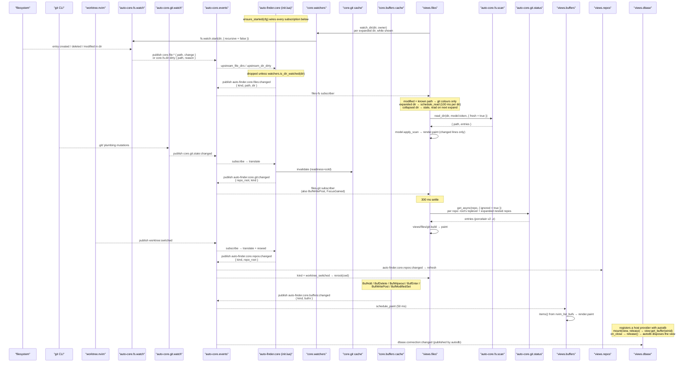

# auto-finder.nvim — architecture

This document describes the plugin's internal structure as of the
ADR 0026 refactor arc (Phases 1–8 shipped on the `core-skeleton`
branch), with the files and buffers slots as rebuilt by ADR 0200
(an in-house lazy tree; the vendored neo-tree fork was retired).
It is meant for contributors who need to navigate the code; users
only need `README.md`.

The canonical design rationale lives in
[`shared/adrs/0026-auto-finder-state-ui-separation.md`](https://git.johnosoft.org/knowledge-base/global-kb)
of the project KB. This document is the post-implementation
summary — what shipped, how the pieces talk to each other, and
which surfaces are stable vs. transitional.

## Contents

- [Top-level layout](#top-level-layout)
- [System architecture diagram](#system-architecture)
- [Module catalog](#module-catalog)
- [Event flow diagram](#event-flow--pubsub-with-auto-core)
- [auto-core dependency surface](#auto-core-dependency-surface)
- [Lifecycle](#lifecycle)
- [Versioning policy](#versioning-policy)
- [Pointers for new work](#pointers-for-new-work)

---

## Top-level layout

```
lua/auto-finder/
├── init.lua                  public API (setup / open / close / focus / resize)
├── config.lua                config schema, validation, width resolution
├── state.lua                 persistent UI state via auto-core.state.namespace
├── log.lua                   auto-core.log shim (component prefix "auto-finder.*")
├── _storage.lua              JSON-on-disk helpers for the per-config `.auto-finder/` store
│
├── core/                     runtime state component (single source of truth)
│   ├── init.lua              core.ensure_started / stop / reload / is_started; upstream topic translators
│   ├── events.lua            auto-finder.core.* topic registry + pub/sub
│   ├── git.lua               git status denormalized view (auto-core.git.status)
│   ├── buffers.lua           buffer-list cache (Buf* autocmd driven)
│   ├── repos.lua             repos registry view (auto-finder.repos / worktree.nvim)
│   └── watchers.lua          directory watches refcounted by owner + per-worktree repos watches
│
├── views/                    UI view modules; each is a renderer
│   ├── init.lua              view registry (load / setup / resolve / active)
│   ├── config/init.lua       control surface (prompt REPL)
│   ├── files/                files slot — lazy tree (ADR 0200)
│   │   ├── init.lua          section contract, suspend/resume, subscriptions, keymaps
│   │   ├── model.lua         lazy tree: nodes by path, a directory read only when expanded
│   │   ├── render.lua        pure row builder + changed-lines-only paint (shared with buffers)
│   │   ├── git.lua           git status entries → per-path colour codes, directory roll-up
│   │   ├── actions.lua       add / delete / rename / move / paste / `i` details float
│   │   ├── search.lua        `/` search via fd / fdfind / find
│   │   └── highlights.lua    AutoFinder* groups, default-linked to NeoTree* (colour contract)
│   ├── buffers/init.lua      listed buffers as a tree, painted by files/render.lua
│   ├── repos/                repos explorer over worktree.nvim (init.lua → tree.lua)
│   └── dbase/init.lua        facade over autodb's drawer (ADR-0078)
│
├── sections/                 backwards-compat facade (one-liners → views/*)
│
├── shared/                   pure helpers, no UI state of their own
│   ├── help.lua              `?` keymap overlay every view installs
│   ├── loading.lua           generation-tagged placeholder buffer factory
│   ├── window.lua            is_any_panel / is_auto_finder_panel predicates
│   ├── view_subs.lua         per-view subscription set with replace-or-add
│   └── debounce.lua          coalesce helper (generation-counter cancel)
│
├── panel/
│   ├── host.lua              owns the panel window (vsplit, winfixwidth, winfixbuf)
│   ├── window_style.lua      window-local look for every filetype=auto-finder buffer
│   ├── admin.lua             config-view REPL implementation
│   └── wizard.lua            first-run setup wizard
│
└── repos.lua                 thin facade over worktree.nvim for repo discovery
```

Internal callers use direct paths (`auto-finder.core.watchers`,
`auto-finder.views.files`, `auto-finder.shared.help`). The
`sections/` tree is preserved as a one-line facade re-exporting
from `views/*` for any third-party consumer pinned to the older
`auto-finder.sections.<name>` namespace through `v0.2.x`.

---

## System architecture


```mermaid
flowchart TB
    %% =========================
    %% USER & API
    %% =========================
    USER([User])
    CMD["nvim commands<br/>:AutoFinder*<br/>require('auto-finder').setup/open/focus/resize"]
    USER --> CMD

    %% =========================
    %% PUBLIC API LAYER
    %% =========================
    subgraph PUBLIC ["Public API (auto-finder)"]
        direction TB
        INIT["init.lua<br/>setup/open/close/toggle/focus/resize"]
        CONFIG["config.lua<br/>schema · validate · apply"]
        STATE["state.lua<br/>persistent UI prefs"]
        LOG["log.lua<br/>auto-core.log shim"]
    end
    CMD --> INIT
    INIT --> CONFIG
    INIT --> STATE
    INIT --> LOG

    %% =========================
    %% CORE (RUNTIME STATE)
    %% =========================
    subgraph CORE ["core/ (runtime state - single source of truth)"]
        direction LR
        COREINIT["init.lua<br/>ensure_started · stop · reload"]
        CEVENTS["events.lua<br/>auto-finder.core.* topics<br/>publish/subscribe"]
        CGIT["git.lua<br/>git status view"]
        CBUF["buffers.lua<br/>buffer list cache"]
        CREPOS["repos.lua<br/>repos registry view"]
        CWATCH["watchers.lua<br/>dir watches by owner<br/>+ per-worktree watches"]

        COREINIT --> CEVENTS
        COREINIT --> CWATCH
        COREINIT -.is_dir_watched.-> CWATCH
        CBUF -.autocmds.-> COREINIT
    end
    INIT -- "ensure_started(cfg)" --> COREINIT

    %% =========================
    %% VIEWS (UI RENDERERS)
    %% =========================
    subgraph VIEWS ["views/ (UI renderers)"]
        direction LR
        VREG["init.lua<br/>registry · active()"]
        VCONFIG["config/<br/>prompt REPL"]
        VFILES["files/<br/>lazy tree · model · render"]
        VBUF["buffers/<br/>open buffers"]
        VREPOS["repos/<br/>git worktrees"]
        VDBASE["dbase/<br/>autodb drawer<br/>(host provider)"]

        VREG -.loads.-> VCONFIG
        VREG -.loads.-> VFILES
        VREG -.loads.-> VBUF
        VREG -.loads.-> VREPOS
        VREG -.loads.-> VDBASE
        VBUF -- "render.row / paint" --> VFILES
    end
    VFILES -- "watch_dir / unwatch_owner" --> CWATCH

    %% =========================
    %% SHARED HELPERS
    %% =========================
    subgraph SHARED ["shared/ (pure helpers)"]
        direction LR
        SHELP["help.lua<br/>? keymap overlay"]
        SLOAD["loading.lua<br/>placeholder factory"]
        SWIN["window.lua<br/>panel predicates"]
        SSUBS["view_subs.lua<br/>subscription sets"]
        SDEB["debounce.lua<br/>coalesce(fn, ms)"]
    end
    VFILES --> SHELP
    VBUF --> SHELP
    VFILES --> SSUBS
    VBUF --> SSUBS
    COREINIT --> SDEB

    %% =========================
    %% PANEL (WINDOW HOST)
    %% =========================
    subgraph PANEL ["panel/ (window host)"]
        direction LR
        PHOST["host.lua<br/>vsplit · winfixwidth/winfixbuf<br/>with_unfixed_buf"]
        PSTYLE["window_style.lua<br/>window-local look"]
        PADMIN["admin.lua<br/>REPL backend (for views/config)"]
    end
    INIT --> PHOST
    VCONFIG --> PADMIN
    VFILES --> PSTYLE
    VBUF --> PSTYLE

    %% =========================
    %% AUTO-CORE DEPENDENCY
    %% =========================
    subgraph AUTOCORE ["auto-core.nvim (soft-dep, plugin-level)"]
        direction LR
        ACEVT["events<br/>publish/subscribe bus"]
        ACFS["fs.watch<br/>libuv fs_event wrapper"]
        ACSCAN["fs.scan<br/>single-flight dir reads"]
        ACGITW["git.watch<br/>.git/ plumbing watcher"]
        ACGITS["git.status<br/>porcelain v2 cache · get_async"]
        ACSTATE["state<br/>namespace persistence"]
        ACPANEL["ui.panel<br/>panel primitive"]
        ACSECTION["ui.section<br/>section registry"]
        ACLOG["log<br/>ring + notify"]
    end
    LOG --> ACLOG
    STATE --> ACSTATE
    PHOST --> ACPANEL
    INIT -.wraps views into.-> ACSECTION
    CEVENTS --> ACEVT
    CWATCH --> ACFS
    CWATCH --> ACGITW
    CGIT --> ACGITS
    VFILES -- "read_dir / cancel" --> ACSCAN
    VFILES -- "get_async" --> ACGITS

    %% =========================
    %% EVENT FLOW (DASHED)
    %% =========================
    ACEVT -. "core.file:*<br/>core.fs.dir:dirty<br/>core.git.state:changed<br/>worktree:switched" .-> COREINIT
    COREINIT -. "auto-finder.core.*<br/>files/git/buffers/repos" .-> ACEVT
    ACEVT -. "auto-finder.core.*" .-> VFILES
    ACEVT -. "auto-finder.core.*" .-> VBUF
    ACEVT -. "auto-finder.core.*" .-> VREPOS
    ACEVT -. "auto-finder.core.*" .-> VDBASE

    classDef public fill:#e8f0ff,stroke:#5a78b3,stroke-width:1px;
    classDef core fill:#e3f7e3,stroke:#3a7a3a,stroke-width:1px;
    classDef views fill:#fff4d6,stroke:#a08020,stroke-width:1px;
    classDef shared fill:#f0e6ff,stroke:#7050b0,stroke-width:1px;
    classDef panel fill:#ffe3e3,stroke:#a04040,stroke-width:1px;
    classDef autocore fill:#d6f0f5,stroke:#3080a0,stroke-width:1px;

    class INIT,CONFIG,STATE,LOG public;
    class COREINIT,CEVENTS,CGIT,CBUF,CREPOS,CWATCH core;
    class VREG,VCONFIG,VFILES,VBUF,VREPOS,VDBASE views;
    class SHELP,SLOAD,SWIN,SSUBS,SDEB shared;
    class PHOST,PSTYLE,PADMIN panel;
    class ACEVT,ACFS,ACSCAN,ACGITW,ACGITS,ACSTATE,ACPANEL,ACSECTION,ACLOG autocore;
```

### Reading the diagram

- **Solid arrows** are direct module dependencies (require / call).
- **Dotted arrows with labels** are event-bus subscriptions or
  cache-handle relationships.
- The four colored groups are the architectural tiers:
  - **Public API** — the only surface `init.lua` external callers
    touch.
  - **`core/`** — single source of truth for shared runtime
    state: git status, buffer list, repo registry, and every
    libuv watch handle. The files tree itself is view state
    (`views/files/model.lua`); core only owns its directory
    watches and translates their events.
  - **`views/`** — renderers. They subscribe to translated
    `auto-finder.core.*` topics and do **not** subscribe to
    upstream `core.*` topics directly (A1 acceptance; smoke [32]
    greps for `core.file:`, `core.git.state:`, `core.fs.`,
    `worktree:` and `state.core:`). Even the files view's
    hidden/dotfile filters arrive as `auto-finder.core.files:filters`.
  - **`shared/`** — pure helpers (no state, no UI).
- **`auto-core.nvim`** is a soft-dep at the plugin level; most
  auto-core surfaces auto-finder uses are wrapped in a `pcall`
  loadability check so the plugin degrades gracefully when
  auto-core isn't installed (with the obvious UX caveats — no
  live refresh, no panel singleton, no log ring). The files
  slot is the exception: it calls `auto-core.fs.scan` and
  `auto-core.git.status` unguarded and needs auto-core.

---

## Module catalog

### Public API — `lua/auto-finder/`

| Module | Role |
|---|---|
| `init.lua` | Public surface. `setup` wires `config`, `state`, `log`, the panel host, `core.ensure_started`, and the `auto-core.ui.section` registry against the loaded views. |
| `config.lua` | Config schema (width, default_section, sections, view_modules + legacy section_modules alias, per-view opts). `apply` validates + merges defaults; `resolve_width` clamps to `[min..max]`. |
| `state.lua` | Persistent UI state via `auto-core.state.namespace("auto-finder", { persist = "json" })`. Tracks `user_width` (resize pin), `last_section`, per-project section composition. |
| `log.lua` | Single-file logging shim per ADR 0021 §6. All plugin code calls into `auto-finder.log`; never `require("auto-core").log` directly. |
| `_storage.lua` | Legacy JSON store, now only carries `files.*` filter prefs that haven't migrated to a namespace key yet. |

### `core/` — runtime state component

Single source of truth for git status, buffer list, repo
registry, worktree state and every watch handle. Subscribes to
auto-core events on `ensure_started`, maintains caches, publishes
`auto-finder.core.*` topics. The files tree is not cached here:
the files view keeps its own lazy model (ADR 0200).

| Module | Role |
|---|---|
| `core/init.lua` | Lifecycle: `ensure_started(cfg)` is idempotent; `stop()` disposes everything. Owns the per-topic subscription handles and the translators. `upstream_file_dirs` (`core.file:*`) and `upstream_dir_dirty` (`core.fs.dir:dirty`) publish `auto-finder.core.files:changed { kind, path, dir }`, dropping every event whose directory `core/watchers.lua` does not watch; `upstream_files_show_hidden` / `_show_dotfiles` translate `state.core:files.*:changed` into `auto-finder.core.files:filters`. `upstream_file_repos` folds `core.file:*` under a watched worktree into `auto-finder.core.repos:changed`, coalesced 100 ms (via `shared.debounce`). |
| `core/events.lua` | Topic registry (five topics) + thin pub/sub wrappers over `auto-core.events`. Single swap point if a local emitter is ever needed. |
| `core/git.lua` | Denormalized view over `auto-core.git.status`. Converts porcelain entries to `by_path[abs] = { x, y, code }`. Lazy-populated on `snapshot_now`. |
| `core/buffers.lua` | Buf*-autocmd-driven cache. Mirrors `:ls` (listed + unloaded). Augroup re-armed on every `ensure_started`. |
| `core/repos.lua` | Thin denormalized view over `auto-finder.repos` (which is itself a thin facade over `worktree.nvim`). Cache invalidated on `auto-finder.core.repos:changed`. |
| `core/watchers.lua` | Owns every libuv-backed watcher. Directory watches for the files view: `watch_dir(path, owner)` opens one non-recursive `fs.watch` per path (`self_extend = false`, `ignore = {}`), refcounted by owner; `unwatch_dir` / `unwatch_owner` release, the handle closing with its last owner; `is_dir_watched` is the translators' filter. Git watches: `watch_git(path, owner)` / `unwatch_git` / `unwatch_git_owner` / `set_git_owner(owner, set)`, one `git.watch` per path shared by its owners (the files view reconciles its holds to exactly the repos it shows on every git refresh). Per-worktree watches for the repos panel: `reconcile_watched()` holds a `git.watch` (through `watch_git`) and one recursive working-tree `fs.watch` per worktree in worktree.nvim's watch registry. `close_all()` releases everything. |

### `views/` — UI renderers

| View | Implementation | Notes |
|---|---|---|
| `config` | REPL via `panel/admin.lua` | Slot 0 — control surface. |
| `files` | `views/files/` — lazy tree over the cwd (table below) | Reads through `auto-core.fs.scan`, watches expanded directories through `core/watchers.lua`, colours names from `auto-core.git.status.get_async`. Live refresh via `auto-finder.core.files:changed` (re-reads the one named directory) and `auto-finder.core.git:changed`. Re-roots on `worktree_switched` and `DirChanged`. |
| `buffers` | `views/buffers/init.lua` — listed buffers from `nvim_list_bufs()`, grouped under the cwd, `TERMINALS`, and one root per outside-cwd bucket | Rows from `views/files/render.lua`. Repaints on `auto-finder.core.buffers:changed`, `DiagnosticChanged`, `BufModifiedSet`, `DirChanged` (50 ms coalesce), only while shown. |
| `repos` | `views/repos/init.lua` → `views/repos/tree.lua` over `worktree.repos` | worktree.nvim is a hard requirement: absent, the slot logs one error and renders an "unavailable" screen. Refresh on `auto-finder.core.repos:changed`. |
| `dbase` | Facade over `autodb.views.drawer` (ADR-0078) | Registers a **host provider** with autodb's drawer registry and mounts the view the registry hands it; autodb constructs and disposes it. `get_buffer` returns a real buffer synchronously, so there is no placeholder mount. With autodb absent, renders a self-explaining placeholder instead. `on_close` calls the registry's `release`. |

The files and buffers slots mount synchronously: `get_buffer`
creates one `bufhidden=hide` buffer and returns it on every show.
Hiding the pane suspends the view (`BufHidden` / `on_close`), and
the next `on_focus` resumes it; the buffer and, for files, the
model survive. No view uses the placeholder pattern today.

#### `views/files/` — files slot modules

| Module | Role |
|---|---|
| `views/files/init.lua` | Section contract (`get_buffer` / `on_focus` / `on_close` / `reset`). `suspend`: `scan.cancel(model.token)`, `model.token = nil`, release every directory and git watch, dispose subscriptions + augroup, stop timers. `resume`: new token, subscribe, arm a watch on every expanded directory, then re-read each once (`fresh`). Event routing, `schedule_read` (100 ms per directory), git colours (`get_async` per repo after a 300 ms settle), diagnostics, follow-current-file (`BufEnter`, 60 ms), keymaps (`DEFAULT_KEYS` + `cfg.files.mappings`). |
| `views/files/model.lua` | Nodes keyed by absolute path; `children == nil` means never read. `read` goes through `auto-core.fs.scan.read_dir(path, model.token, …)` and drops a result whose token moved on. `apply_scan` diffs a listing into `children` (sorted directories first, then path byte order), forgets removed subtrees, records `repo_root`, filters `never_show` and dotfiles. `expand` / `collapse` / `reveal` / `visible` / `expanded_dirs`. |
| `views/files/render.lua` | `row(item, width)` is pure: indent markers, icon (nvim-web-devicons), name, `(cut)`/`(copy)` mark, ` #N` buffer number, right-aligned diagnostic sign → text + highlight spans. `paint(bufnr, prev, rows)` diffs against the previous rows and rewrites only the changed range, re-setting extmarks on exactly those lines. Shared by files and buffers. |
| `views/files/git.lua` | `build(entries, repo_root)` → path → status: `XY` for change records, `??` / `!!` for untracked / ignored records, one bubbled character for directories (priority `U?MADTRC.`). `lookup` falls back to the nearest ancestor's `??` / `!!` record, never a bubbled code. `code` maps a status to the name highlight. |
| `views/files/actions.lua` | Add (trailing `/` makes a directory), add directory, delete (confirm, refuses the root), rename / move (open buffers follow), paste of copy/cut marks, `i` details float. Synchronous libuv calls; the caller re-reads the affected directories. |
| `views/files/search.lua` | `/` search: `*term*` basename match via `fdfind` / `fd`, else `find`, at most 50 results, debounced 150 ms, excludes `never_show`. Results render as a separate model. |
| `views/files/highlights.lua` | `AutoFinder*` groups, each `default = true` linked to its `NeoTree*` name, with the fallback definitions for themes that lack them; re-defined on `ColorScheme`. The one file under `lua/` allowed to name `NeoTree*` (colour-scheme contract, ADR 0200 §4.3). |

### `shared/` — pure helpers

| Module | Role |
|---|---|
| `shared/help.lua` | `install_help_keymap(name, bufnr)` binds `?`; `show_help` lists the buffer's actual normal-mode mappings (`nvim_buf_get_keymap`, with their `desc`) via `auto-core.ui.float.help_overlay`, else a plain float. Used by files, buffers, todos, tests, debug. |
| `shared/loading.lua` | Generation-tagged placeholder factory. `nofile` + `bufhidden=wipe` + readonly buffer with "Loading <view>…". `is_placeholder` / `matches` predicates. No view in `lua/` uses it today. |
| `shared/window.lua` | `is_any_panel(winid)` (broad exclusion) + `is_auto_finder_panel(winid)` (narrow lookup). Per [[auto-core-panel-ownership]]'s asymmetric contract. |
| `shared/view_subs.lua` | `view_subs.new()` returns a set with `replace(slot, topic, cb)` semantics so re-running `on_focus` doesn't duplicate callbacks. |
| `shared/debounce.lua` | `coalesce(fn, ms)` returns `(trigger, cancel)`. Uses a generation counter rather than timer cancellation because `vim.defer_fn` returns nil (see audit-log F8.1). |

### `panel/` — window host

| Module | Role |
|---|---|
| `panel/host.lua` | Owns the panel window (vsplit on the left, `winfixwidth=true`, `winfixbuf=true`). `with_unfixed_buf(winid, fn)` temporarily lifts `winfixbuf` so internal buffer swaps don't trip the guard. |
| `panel/window_style.lua` | On `BufEnter` / `BufWinEnter` / `FileType`, when the panel window shows a `filetype=auto-finder` buffer: cursorline (`cursorlineopt=line`), nowrap, nolist, nospell, nonumber, norelativenumber, and a `winhighlight` onto the `AutoFinder*` groups. Every write is `scope = "local"`; nothing is saved or restored. |
| `panel/admin.lua` | Prompt REPL backing the `config` view. Verb dispatch, history, completion. |
| `panel/wizard.lua` | First-run setup wizard. |

---

## Event flow / pub-sub with auto-core


```mermaid
sequenceDiagram
    participant FS as "filesystem"
    participant GIT as "git CLI"
    participant WT as "worktree.nvim"
    participant ACFS as "auto-core.fs.watch"
    participant ACGW as "auto-core.git.watch"
    participant ACEVT as "auto-core.events"
    participant COREI as "auto-finder.core (init.lua)"
    participant CWATCH as "core.watchers"
    participant COREG as "core.git cache"
    participant COREB as "core.buffers cache"
    participant FILES as "views.files"
    participant SCAN as "auto-core.fs.scan"
    participant GSTAT as "auto-core.git.status"
    participant BUFV as "views.buffers"
    participant REPOS as "views.repos"
    participant DBASE as "views.dbase"

    Note over COREI: ensure_started(cfg) wires every subscription below

    %% ── files: watches follow expansion ──
    FILES->>CWATCH: watch_dir(dir, owner)<br/>per expanded dir, while shown
    CWATCH->>ACFS: fs.watch.start(dir, { recursive = false })
    FS -->>ACFS: entry created / deleted / modified in dir
    ACFS-->>ACEVT: publish core.file:* { path, change }<br/>or core.fs.dir:dirty { path, reason }
    ACEVT-->>COREI: upstream_file_dirs / upstream_dir_dirty
    Note over COREI: dropped unless watchers.is_dir_watched(dir)
    COREI-->>ACEVT: publish auto-finder.core.files:changed<br/>{ kind, path, dir }
    ACEVT-->>FILES: files-fs subscriber
    Note over FILES: modified + known path → git colours only<br/>expanded dir → schedule_read (100 ms per dir)<br/>collapsed dir → stale, read on next expand
    FILES->>SCAN: read_dir(dir, model.token, { fresh = true })
    SCAN-->>FILES: { path, entries }
    FILES->>FILES: model.apply_scan → render.paint (changed lines only)

    %% ── git colours ──
    GIT -->>ACGW: .git/ plumbing mutations
    ACGW-->>ACEVT: publish core.git.state:changed
    ACEVT-->>COREI: subscribe → translate
    COREI->>COREG: invalidate (readiness=cold)
    COREI-->>ACEVT: publish auto-finder.core.git:changed<br/>{ repo_root, kind }
    ACEVT-->>FILES: files-git subscriber<br/>(also BufWritePost, FocusGained)
    Note over FILES: 300 ms settle
    FILES->>GSTAT: get_async(repo, { ignored = true })<br/>per repo: root's toplevel + expanded nested repos
    GSTAT-->>FILES: entries (porcelain v2 -z)
    FILES->>FILES: views/files/git.build → paint

    %% ── worktree switch ──
    WT -->>ACEVT: publish worktree:switched
    ACEVT-->>COREI: subscribe → translate + reseed
    COREI-->>ACEVT: publish auto-finder.core.repos:changed<br/>{ kind, repo_root }
    ACEVT-->>REPOS: auto-finder.core.repos:changed → refresh
    ACEVT-->>FILES: kind = worktree_switched → reroot(cwd)

    %% ── buffers (autocmd-driven, nvim-internal) ──
    Note over COREB: BufAdd / BufDelete / BufWipeout / BufEnter /<br/>BufWritePost / BufModifiedSet
    COREB-->>ACEVT: publish auto-finder.core.buffers:changed<br/>{ kind, bufnr }
    ACEVT-->>BUFV: schedule_paint (50 ms)
    BUFV->>BUFV: items() from nvim_list_bufs → render.paint

    %% ── dbase: autodb's drawer, hosted here ──
    Note over DBASE: registers a host provider with autodb<br/>mount(view, release) → view:get_buffer(winid)<br/>on_close → release() → autodb disposes the view
    ACEVT-->>DBASE: dbase.connection:changed (published by autodb)
```

### Topics published by `core/` (auto-finder-private)

| Topic | Payload | Consumers |
|---|---|---|
| `auto-finder.core.files:changed` | `{ kind = 'created'\|'deleted'\|'modified'\|'dirty', path, dir }` — published only for a `dir` `core/watchers.lua` watches; `dirty` means "re-read `dir`" (`path == dir`) | `files` view (re-reads `dir`, or refreshes git colours only for a `modified` known path) |
| `auto-finder.core.files:filters` | `{ what = 'show_hidden'\|'show_dotfiles' }` — translated from `state.core:files.<what>:changed` | `files` view (re-filters; dotfiles re-read the expanded dirs) |
| `auto-finder.core.git:changed` | `{ repo_root, kind, paths? }` | `files` view (schedules git colours); core's repos fold (→ `repos:changed`) |
| `auto-finder.core.buffers:changed` | `{ kind = 'add'\|'remove'\|'enter'\|'modify', bufnr }` | `buffers` view |
| `auto-finder.core.repos:changed` | `{ kind, repo_root }` | `repos` view; `core.repos` cache (invalidates); `files` view (`kind = 'worktree_switched'` → re-root) |

### Topics consumed by `core/` (upstream auto-core)

| Topic | Translated to | Source |
|---|---|---|
| `core.file:created` / `:modified` / `:deleted` | `auto-finder.core.files:changed` (kind = the topic suffix, `dir` = the parent) when the parent is watched; `auto-finder.core.repos:changed` (coalesced 100 ms) when the path is under a watched worktree | `auto-core.fs.watch` |
| `core.fs.dir:dirty` | `auto-finder.core.files:changed` (kind='dirty', `path = dir`) when the directory is watched | `auto-core.fs.watch` (nameless event or handle error) |
| `core.git.state:changed` | `auto-finder.core.git:changed` + drop `core.git` readiness | `auto-core.git.watch` (per ADR 0025) |
| `worktree:switched` | `auto-finder.core.repos:changed` + `M._reseed_sections_for_workspace` + `M._drop_repos_bufnr_on_worktree_switched` | `worktree.nvim` |
| `core.workspace_root:changed` | reseed only | `worktree.nvim` |
| `state.auto-finder:user_width:changed` | mirrors to `M.state.user_width` + panel resize | `auto-core.state.namespace` |
| `state.auto-finder:last_section:changed` | mirrors to `M.state.section` | `auto-core.state.namespace` |

All subscriptions live inside `core.ensure_started(cfg)` per
[[auto-core-events-subscription-lifecycle]] — no load-bearing
module-load subscribes. Bus reset survives via unconditional
dispose-first-then-resubscribe (ADR §2.2 contract).

---

## auto-core dependency surface

auto-finder is a **soft-dep consumer** of auto-core — the
surfaces listed below are wrapped in a `pcall` loadability check
at the auto-finder side, except `auto-core.fs.scan` and
`auto-core.git.status` in the files view, which it requires
directly. The plugin runs (with reduced functionality, and no
files slot) when auto-core isn't installed.

| auto-core surface | auto-finder consumer | What it provides |
|---|---|---|
| `auto-core.events` | `core/events.lua` (wrapper), `core/init.lua` (subscriptions), all `auto-finder.core.*` publishes | Pub/sub bus. Single transport for both upstream + private topics. |
| `auto-core.fs.watch` | `core/watchers.lua::watch_dir` (non-recursive, one per expanded files-view directory), `::reconcile_watched` (recursive, one per watched worktree) | libuv `fs_event` wrapper. Publishes `core.file:*` and `core.fs.dir:dirty`. |
| `auto-core.fs.scan` | `views/files/model.lua::read`, `views/files/init.lua::suspend/reroot` (`cancel`) | Asynchronous one-directory reads: single-flight per path, one rerun for `fresh` requests, `MIN_INTERVAL_MS` rate limit, `MAX_INFLIGHT` cap, `BATCH`-entry yields. Owners are tables compared by identity. |
| `auto-core.git.watch` | `core/watchers.lua::watch_git` (files view per shown repo; `reconcile_watched` per watched worktree) | `.git/` plumbing watcher (ADR 0025). Publishes `core.git.state:changed`. Soft-dep on auto-core ≥ v0.1.19. |
| `auto-core.git.status` | `views/files/init.lua::git_refresh` (`get_async`), `core/git.lua::snapshot_now`, `core.git.invalidate` | Cached `git status --porcelain=v2 -z` per repo (`--no-optional-locks`; `ignored = true` adds `--ignored=matching`). `get_async` shares one subprocess per (root, ignored). |
| `auto-core.files` | `views/files/init.lua` (`get_show_hidden` / `set_show_hidden` / `get_show_dotfiles`); `core/init.lua` translates `state.core:files.*:changed` → `auto-finder.core.files:filters` | The hidden / dotfile toggles the files view filters by. |
| `auto-core.state` | `state.lua` | Namespace persistence (`auto-finder.json` in `stdpath("state")`). |
| `auto-core.ui.panel` | `panel/host.lua` | Panel primitive — vsplit + winfixwidth/winfixbuf marker stamping. |
| `auto-core.ui.section` | `init.lua` (registry wrapper) | Section registry. Wraps each `views/<name>` into its `AutoCoreSectionDef` shape. Binds `0..9` + `q`-close keymaps on each section buffer. |
| `auto-core.log` | `log.lua` (shim) | Ring buffer + level filter + toast routing via `notify` / `notifyIf`. |
| `auto-core.git.worktree` | `repos.lua::root`, `_workspace_key`, the reseed path | Workspace root detection + worktree enumeration. |
| `worktree.nvim` (indirect via auto-core) | `repos.lua::load` | Repo discovery under the workspace root. |

The boundary is enforced in two directions:

- **auto-finder does not write into auto-core's internals.** Every
  read is via a public function; every write (e.g.
  `auto-core.git.status.invalidate`) goes through a documented
  surface.
- **auto-core does not know about auto-finder.** Bus topics are
  consumer-routed; no auto-core code references
  `auto-finder.*` symbols.

---

## Event detection + processing

This section walks through every category of event auto-finder
observes — how each is detected at the OS / nvim layer, how it
flows up through auto-core, how `core/` processes it, and what
the views ultimately see.

### 1. Filesystem mutations

**Detection — `auto-core.fs.watch`** wraps libuv's `fs_event`
primitive. auto-finder opens two kinds of watch, both through
`core/watchers.lua`:

- **Files view — one directory each.** `watch_dir(path, owner)`
  starts `fs.watch` with `{ recursive = false, self_extend =
  false }`: one handle on that directory only. The view holds
  one per expanded directory while it is shown, and none while
  hidden.
- **Repos panel — one worktree each.** `reconcile_watched()`
  starts a recursive `fs.watch` (one handle per subdirectory,
  growing into new ones per ADR 0042) for each worktree in
  worktree.nvim's watch registry.

Each `fs_event` callback fires whenever the kernel notifies a
change inside its watched directory (inotify on Linux, FSEvents
on macOS, ReadDirectoryChangesW on Windows).

auto-core publishes four topics off this stream:

- `core.file:created` — entry appeared in a watched directory
  (the libuv event reports `rename` and a fresh `fs_stat`
  succeeds).
- `core.file:modified` — content changed in place (the libuv
  event reports `change`).
- `core.file:deleted` — entry vanished (the libuv event
  reports `rename` and `fs_stat` returns no such file).
- `core.fs.dir:dirty` — something in the directory changed
  and libuv cannot say what (an event with no child name, or
  an error on the handle). Debounced per directory.

**Payload shape:** `core.file:*` carries `{ path: string,
change: 'created'|'modified'|'deleted' }`; `core.fs.dir:dirty`
carries `{ path = dir, reason = 'unnamed'|'error', err? }`.

**Detection limits worth knowing about:**

- A files-view watch covers one directory. A subdirectory
  created inside it arrives as a `created` event for the
  parent; the new directory's own contents are read, and
  watched, only once it is expanded.
- libuv's `fs_event` classifies `rename-with-stat` as "created"
  and `rename-without-stat` as "deleted." It does **not**
  surface paired old→new rename events. `mv old new` arrives as
  two unrelated events. The files view needs no reassembly:
  each event names its parent directory, and that directory is
  re-read.
- macOS's FSEvents backend is known to drop rename/delete
  events in rapid-burst scenarios. The user-visible symptom is
  the files panel needing manual `R` to pick up an external
  `mv` / `rm`. This is filed against auto-core for a darwin
  reliability fix (see project KB synthesis
  `auto-core-fs-event-macos-reliability.md`); auto-finder does
  not patch this from its side.
- `auto-core.fs.watch`'s `DEFAULT_IGNORE` (`/.git/`,
  `/node_modules/`, `/dist/`, `/build/`, `/target/`, …) is
  matched against the FULL event path. The repos panel's
  recursive working-tree watches keep it (they must not walk
  build output); `watch_dir` passes `ignore = {}`, because an
  expanded `build/` — or a cwd below one — would otherwise never
  update, and one non-recursive watch reports only direct
  children. `.git/` changes reach the pane through `git.watch`
  (§2).

**Processing — `core/init.lua` translators, then the files
view:**

```
core.file:<kind> { path }                core.fs.dir:dirty { path }
   │  dir = dirname(path)                   │  dir = path
   │  (upstream_file_dirs)                  │  (upstream_dir_dirty)
   └──────────────┬─────────────────────────┘
                  ├─ watchers.is_dir_watched(dir)?  no → drop
                  └─ publish auto-finder.core.files:changed { kind, path, dir }
                       │
                       └─ views/files subscriber ("files-fs"), while shown:
                            ├─ dir not in the model          ↦ ignore
                            ├─ kind == 'modified', path known ↦ git colours only
                            ├─ dir expanded and read         ↦ schedule_read(dir)
                            │     (100 ms, coalesced per directory)
                            │   ↦ auto-core.fs.scan.read_dir(dir, model.token,
                            │                               { fresh = true })
                            │   ↦ model.apply_scan (diff into children;
                            │     removed subtrees forgotten, their watches released)
                            │   ↦ render.paint (changed line range only;
                            │     extmarks re-set on exactly those lines)
                            ├─ dir collapsed, read before    ↦ stale = true
                            │     (re-read on the next expand)
                            └─ git colours scheduled (300 ms settle)
```

The same `core.file:*` stream also feeds the repos panel: a
path under a watched worktree publishes
`auto-finder.core.repos:changed`, coalesced 100 ms (ADR-0060
§2.3).

**Cost.** An event re-reads the one directory it names; only
the `R` key re-reads every expanded directory, and nothing reads
a collapsed one. `auto-core.fs.scan` bounds the
rest: one read per path at a time; a `fresh` request made
during a read is served by exactly one follow-up read; no path
is read twice within `MIN_INTERVAL_MS` (250 ms — a later request
is deferred to the window's end, never dropped); at most
`MAX_INFLIGHT` (8) reads run at once; a read yields to the main
loop every `BATCH` (512) entries. A read result whose owner
token no longer matches `model.token` is discarded.

**Hide and show.** Nothing is read at startup: the files view
reads only when shown, and only expanded directories. On hide
(`BufHidden` / `on_close`) `suspend` cancels the token's reads
(`scan.cancel`), clears `model.token`, releases every watch
(`unwatch_owner`), disposes its subscriptions and augroup, and
stops its timers; the model and buffer are kept. On show
`resume` creates a new token, re-subscribes, arms a watch on
every expanded directory, then re-reads each once (`fresh`),
resolves the repo toplevel (which schedules git colours) and
paints. A focus while already shown only re-subscribes (replace
semantics) and re-roots if the cwd moved. A re-root
(`DirChanged`, `worktree_switched`) cancels the old token,
releases the watches and starts a new model at the new cwd.

### 2. Git plumbing mutations

**Detection — `auto-core.git.watch`** (ADR 0025) opens three
narrow libuv `fs_event` handles per repo:

- `git_dir/` (filtered to `HEAD`, `index`, `ORIG_HEAD`,
  `MERGE_HEAD`, `FETCH_HEAD`)
- `git_dir/refs/heads/`
- (deliberately excluded: `git_dir/refs/remotes/` — too noisy
  for fetch-only events; consumers that care subscribe to
  `core.git.fetch:completed` per ADR 0007)

Each watcher attaches to the **per-worktree** git_dir (linked
worktrees store HEAD/index under
`<common_dir>/worktrees/<name>/` rather than the shared
common_dir) so branch/index events for sibling worktrees don't
cross-fire.

auto-finder starts `git.watch` through `core/watchers.lua`'s
`watch_git(path, owner)` registry, one handle per path shared by
its owners: the files view holds one for every repo whose
colours it shows (the cwd's toplevel and expanded nested repos),
released on hide; `reconcile_watched` holds one per worktree the
repos panel watches. A commit or `git add` from a terminal — no
working-tree event at all — recolours the pane through this.

The watcher coalesces events within a 200 ms window and
ignores `.lock` files (intermediate writes; the non-lock event
fires ms later). It publishes a single coarse topic:

- `core.git.state:changed` with payload `{ repo_root, git_dir,
  kind = 'head'|'index'|'refs'|'merge'|'other' }`.

**Classification by which handle fired:**

- HEAD or ORIG_HEAD → `kind = 'head'` (branch tip moved,
  checkout, reset)
- index → `kind = 'index'` (`git add`, `git restore --staged`)
- refs/heads/* → `kind = 'refs'` (local branch created /
  deleted)
- MERGE_HEAD → `kind = 'merge'` (mid-merge state)
- anything else → `kind = 'other'`

**What triggers a publish:**

- `git commit` mutates HEAD + index → publishes `kind='head'`
  AND `kind='index'` (debounce collapses them to two emits per
  logical operation).
- `git add` / `git restore --staged` mutates index alone →
  `kind='index'`.
- `git checkout <branch>` mutates HEAD + may touch refs →
  `kind='head'` (+ `kind='refs'` if branch tips moved).
- `git reset` / `git reset --hard` → mostly `kind='head'`.
- `git fetch` → mutates `refs/remotes/*` which is **deliberately
  not watched**; no publish. (Use `core.git.fetch:*` if you
  need fetch events.)

**Processing — `core/init.lua` translator:**

```
core.git.state:changed { repo_root, kind }
   │
   ├─ require("auto-finder.core.git")._set_readiness("cold")
   │   (drops the auto-finder-side git cache so the next
   │    snapshot_now triggers a fresh query)
   │
   └─ publish auto-finder.core.git:changed { repo_root, kind }
       │
       ├─ views/files subscriber ("files-git"), while shown:
       │    ↦ git_schedule (300 ms settle; BufWritePost,
       │      FocusGained, files:changed events, show and
       │      re-root share the same timer)
       │    ↦ auto-core.git.status.get_async(repo, { ignored = true })
       │      for the root's toplevel and each expanded
       │      directory with repo_root = true
       │    ↦ views/files/git.build → paint (changed rows only)
       │
       └─ core's repos fold → auto-finder.core.repos:changed
```

`auto-core.git.status` (the underlying porcelain cache) also
subscribes to `core.git.state:changed` directly and invalidates
its own per-repo cache. Two independent caches both react;
the next `get_async` / `get` re-runs git.

**Colour data path.** `get_async` runs `git --no-optional-locks
status --porcelain=v2 -z --ignored=matching`, single-flight
per (repo, ignored) and cached until invalidated;
`--no-optional-locks` keeps the read from rewriting the index,
so it cannot re-trigger `core.git.state:changed`. A result is
dropped unless its token still equals `model.token`.
`views/files/git.build` turns the entries into `status[path]`:
`XY` for change records, `??` / `!!` for untracked / ignored
records (a `dir/` record stands for its subtree), and one
bubbled character per directory — the most significant of its
descendants. `lookup` falls back to the nearest ancestor's
`??` / `!!` record, never to a bubbled code. With hidden files
off, `!!` paths are left out of `model.visible`. The directory
read never triggers a git read, except when it reveals a `.git`
entry the colours have no status for yet (a nested repo).
`core/git.lua`'s sync `snapshot_now` / `by_path` view remains,
with no caller in `lua/` today.

### 3. Buffer-list mutations

**Detection — nvim's native autocmd events.** No libuv layer;
`core/buffers.lua::_arm_autocmds` creates an augroup named
`auto-finder.core.buffers` and subscribes to:

- `BufAdd` — a new buffer was added to the buffer list (any
  source: `:edit`, `:badd`, session restore, LSP workspace
  registration, scripted buffer adds via Lua API).
- `BufDelete` + `BufWipeout` — buffer was deleted from the
  list (`:bd`, `:bw`, `vim.api.nvim_buf_delete`).
- `BufEnter` — buffer became current in some window.
- `BufWritePost` + `BufModifiedSet` — buffer's modified flag
  changed (write succeeded; `:set [no]modified`; first
  modification after open).

Each autocmd carries `args.buf` (the bufnr).

**Processing — `core/buffers.lua::_mutate`:**

```
autocmd fires { buf }
   │
   ├─ if kind == "remove":
   │     M._cache[buf] = nil
   │ else:
   │     M._cache[buf] = _build_entry(buf)
   │     (re-reads vim.bo[buf].{buflisted, modified, filetype, buftype}
   │      + nvim_buf_get_name + nvim_buf_is_loaded)
   │
   └─ publish auto-finder.core.buffers:changed { kind, bufnr }
       │
       └─ views.buffers subscriber ("buffers"), while shown:
            ↦ schedule_paint (50 ms; DiagnosticChanged,
              BufModifiedSet and DirChanged share it)
            ↦ M.items() rebuilds the rows from nvim_list_bufs()
            ↦ render.paint (changed range only)
```

Entry shape: `{ bufnr, name, listed, loaded, modified,
filetype, buftype }`. The cache is pre-populated from
`nvim_list_bufs()` at arm time so `snapshot_now` works from the
first call (no lag while events trickle in).

The augroup is cleared + recreated idempotently on every
`ensure_started` — a re-arm after bus reset or `:Lazy reload`
leaves a single live group, never duplicates.

The buffers view reads the buffer list itself; the
`core.buffers` cache is its event source. On hide, `suspend`
disposes the view's subscription, augroup and timer.

### 4. Worktree / workspace-root mutations

**Detection — `worktree.nvim` publishes via `auto-core.events`.**
Two related topics:

- `worktree:switched { from, to }` — user invoked the worktree
  picker (`<leader>gw` or programmatic
  `worktree.switch(path)`); the cwd changed to a sibling
  worktree.
- `core.workspace_root:changed { root }` — the workspace root
  itself was discovered or changed (typically at startup once
  worktree.nvim's lazy-load completes, OR on
  `worktree.set_root(p)`).

Detection isn't filesystem-level here; it's a domain event
published by the worktree.nvim plugin when its own state moves.

**Processing — `core/init.lua` translator:**

```
worktree:switched { from, to } (or { new_root })
   │
   ├─ publish auto-finder.core.repos:changed
   │   { kind = "worktree_switched", repo_root = to/new_root }
   │
   └─ vim.schedule, then invoke (via require("auto-finder")):
        ↦ M._reseed_sections_for_workspace()
            (per-project sections override — workspace-keyed
             from auto-finder.state. if a project has a saved
             slot composition different from the current
             one, rebuild the registry.)
        ↦ M._drop_repos_bufnr_on_worktree_switched()
            (drop the repos view's cached buffer so the next
             focus re-mounts against the new cwd.)

core.workspace_root:changed { root }
   │
   └─ vim.schedule, then invoke M._reseed_sections_for_workspace()
       (same reseed path; no auto-finder.core.repos:changed
        publish — that one's reserved for explicit user
        switches.)
```

Downstream, `core.repos` listens to its own
`auto-finder.core.repos:changed` topic via an internal hook in
`ensure_started` and calls `core.repos.invalidate()` so the
next `snapshot_now` re-queries `auto-finder.repos.load()`
(which delegates to `worktree.git.list_child_repos(root)` plus
the root itself if it's a git repo).

The files view subscribes to the same topic and re-roots at the
new cwd on `kind = 'worktree_switched'` (it also re-roots on
`DirChanged`).

### 5. UI-state mutations (persistent prefs)

**Detection — `auto-core.state.namespace` `:watch`** internally
subscribes to `state.auto-finder:<key>:changed` topics on the
events bus. Mutations originate from:

- The config-view REPL (`panel/admin.lua`'s `resize` /
  `last_section` verbs).
- The `M.resize(n)` / `M.reset_width()` public API.
- A future `:AutoCoreState` admin tool, or a peer plugin
  writing into the same namespace.

**Topics:**

- `state.auto-finder:user_width:changed { namespace, key,
  new, old }` — resize pin updated.
- `state.auto-finder:last_section:changed` — last-focused
  section persisted.

**Processing — `core/init.lua` translator** (Phase 3 swept
these out of `init.lua`'s setup-time subscribes into
`ensure_started` for re-armability):

```
state.auto-finder:user_width:changed { new }
   │
   ├─ auto-finder.state.user_width := new
   │
   ├─ if M._panel:
   │     if new: M._panel:resize(new)
   │     else:   M._panel:reset_width()
   │
   └─ panel.host._refresh_after_resize(state)

state.auto-finder:last_section:changed { new }
   │
   └─ auto-finder.state.section := new
```

These watchers honor the events lifecycle convention — they're
armed inside `ensure_started`'s handle table so a bus reset
re-arms them on the next `M.open` / `M.focus`.

### 6. dbase view events (published by autodb)

The dbee event bridge that used to live here (`views/dbase/events.lua`)
was deleted with nvim-dbee in v0.4.0. There is nothing to forward now:
**autodb publishes `dbase.connection:changed` to auto-core itself**
(`autodb/lua/autodb/session.lua`), and this plugin is a subscriber like
any other.

The topic KEY is a stable cross-plugin contract and was deliberately kept
across the backend change, so consumers written against the dbee era keep
working. The sibling `dbase.call:*` / `dbase.result:shown` topics remain
registered in auto-core but currently have **no publisher** — the bridge
that emitted them is gone and autodb does not yet surface per-call
lifecycle; they are reserved for it.

### 7. Section / view-switch events (panel-internal)

When the user presses `0..9` or invokes
`:AutoFinderFocus <name>`, `auto-core.ui.section.Registry:focus`
runs through:

```
M.focus(N|name)
   │
   ├─ ensure_started (defensive re-arm)
   ├─ Registry:_resolve(key) → section_def
   ├─ if cached _bufs[N] valid: reuse
   │   else: panel:with_unfixed_buf(function() return section.get_buffer(panel) end)
   ├─ panel:with_unfixed_buf(function()
   │     nvim_win_set_buf(panel.winid, bufnr)
   │   end)
   ├─ self.active := N
   ├─ apply_keymap(self, bufnr)   -- 0..9 + q on the buffer
   ├─ section.on_focus(panel, bufnr)
   └─ self:_refresh_winbar()
```

The `with_unfixed_buf` wrapper temporarily lifts `winfixbuf` on
the panel window so the buffer swap doesn't trip the guard.
auto-core's panel module enforces the marker
(`w:auto_core_panel_name = "auto-finder"`) that
`shared.window.is_auto_finder_panel` checks.

No event-bus topic is emitted for view switches today (a
future `auto-finder.core.view:switched` topic could surface
this if a peer plugin needed to react — out of scope for
ADR 0026).

---

## Lifecycle

```
plugin load          : files loaded; no side effects (modules cached by Lua)
auto-finder.setup()  : config validated → state.namespace claimed →
                       log events registered → core.ensure_started →
                       panel host registered → views loaded → autocmds
core.ensure_started  : (idempotent, safe to re-call)
                       dispose any prior handles →
                       subscribe upstream auto-core topics →
                       reconcile_watched (per-worktree watches) →
                       arm Buf* augroup for core.buffers
                       (no directory is read or watched here)
M.open(force)        : ensure_started (defensive) →
                       panel.host.ensure_open →
                       focus last/default section
M.focus(N|name)      : ensure_started (defensive) →
                       Registry:focus(N) →
                       section.get_buffer → section.on_focus
                       (files / buffers: resume — subscribe,
                        arm watches, re-read expanded dirs, paint)
M.close()            : panel.host.close (section buffers survive;
                       files / buffers suspend on BufHidden)
core.stop()          : dispose handles → close all watchers
                       (directory + per-worktree) → cancel the
                       repos debounce → disarm the Buf* augroup
VimLeavePre          : core.stop
```

The re-armable lifecycle contract (ADR §2.2 — implemented in
Phase 3) means `ensure_started` is safe to call from any code
path that crosses a "do we still have working subscriptions?"
boundary, including bus-reset recovery (`auto-core.events._reset_for_tests`
or `:Lazy reload auto-core`). Default implementation is
dispose-first-then-resubscribe; an optional `_handles_still_valid`
optimization is reserved for when auto-core ships a
`core.events:bus_reset` topic (Open Question #1).

---

## Versioning policy

This plugin follows the per-project rule documented in the
contributor's global `CLAUDE.md`:

- Stays within the existing minor line (`v0.2.x`) until explicit
  approval to bump minor or major.
- The ADR 0026 refactor arc (Phases 1–9) lands as a series of
  commits on the `core-skeleton` branch and tags **once** at the
  end of all phases (no per-phase tags).
- `autovim` (the consumer config) pins via `version = "^0.2.0"`
  caret so lazy.nvim auto-updates within `v0.2.x` and refuses to
  cross the minor boundary unprompted.

The ADR 0026 acceptance ledger (`shared/synthesis/auto-finder-state-ui-separation-refactor.md`
in the project KB) is the single source of truth for phase status.

---

## Pointers for new work

If you're adding…

- **A new view.** Drop it under `views/<name>/init.lua`: a
  section module with `name`, `get_buffer(panel_winid)` (create
  the buffer once, `bufhidden=hide`, return it on every show),
  `on_focus(panel_winid, bufnr)` and `on_close()`. The view
  renders with its own code; a tree-shaped view can reuse
  `views/files/render.lua` (`row` + `paint`) as the files and
  buffers views do. Subscribe through `shared.view_subs`
  (`replace` on every focus, `dispose_all` on hide), install `?`
  with `shared.help.install_help_keymap`, and do no work while
  hidden. Register the view name in `cfg.sections` (or
  `cfg.view_modules` for an out-of-tree module). View modules
  MUST NOT subscribe to upstream `auto-core.*` topics directly
  (A1) — subscribe to the translated `auto-finder.core.*`
  instead — and MUST NOT open libuv watches themselves: ask
  `core/watchers.lua` (A2).

- **A new shared helper.** Drop it under `shared/<name>.lua`.
  Must be pure (no UI state, no event subscriptions at module
  load). If it needs to subscribe, expose an `arm()` method
  that the consumer calls inside its own lifecycle hook.

- **A new core area** (parallel to files / git / buffers / repos).
  Add `core/<area>.lua` with `snapshot_now` / `snapshot_async` /
  `get` / `_set_readiness` / `_reset_for_tests`. Update
  `core/init.lua` to wire its lifecycle into `ensure_started` and
  `stop`. Update `core/events.lua::TOPICS` with any new
  `auto-finder.core.<area>:changed` topic. Add Buf*/autocmd or
  upstream-topic subscriptions inside `core.ensure_started`, not at
  module load.

- **A new auto-core dependency.** Wrap the import in a
  `pcall(require, "auto-core")` + a type-check on the specific
  surface (`type(core.fs.watch.start) == "function"`) so the
  plugin degrades gracefully on older auto-core or its absence.
  Update the table in the [auto-core dependency surface](#auto-core-dependency-surface)
  section above.

- **A new log call site.** Use `auto-finder.log.<level>("<component>", "msg")`.
  Component must follow `auto-finder.<subtree>.<name>`:
  - `core.<area>` for `core/`
  - `view.<name>` for `views/`
  - `shared.<helper>` for `shared/`
  - `panel.<name>` for `panel/`

- **A new smoke section.** Add to `tests/smoke.lua` using the
  next free section number. Per the test-discipline policy
  documented in `tests/auto-finder-test-audit.md`, every commit
  lands with `failed == 0`. If a smoke fails during development
  and you fix it, append an entry to the audit log with root
  cause + remediation. If a smoke becomes structurally invalid
  (the surface under test moved during a refactor), remove the
  section and document in `tests/auto-finder-flaky.test.md` with
  a reimplementation plan.

---

## See also

- `tests/smoke.lua` — 405 assertions across 34 sections. Run via
  `nvim --headless -u NONE -l tests/smoke.lua`.
- `tests/auto-finder-flaky.test.md` — catalog of smoke sections
  removed during the refactor with reimplementation plans.
- `tests/auto-finder-test-audit.md` — per-phase failure / remediation
  audit log.
- `CHANGELOG.md` — release notes.
- Project KB: `shared/adrs/0026-auto-finder-state-ui-separation.md`
  (canonical design) +
  `shared/synthesis/auto-finder-state-ui-separation-refactor.md`
  (acceptance ledger).
