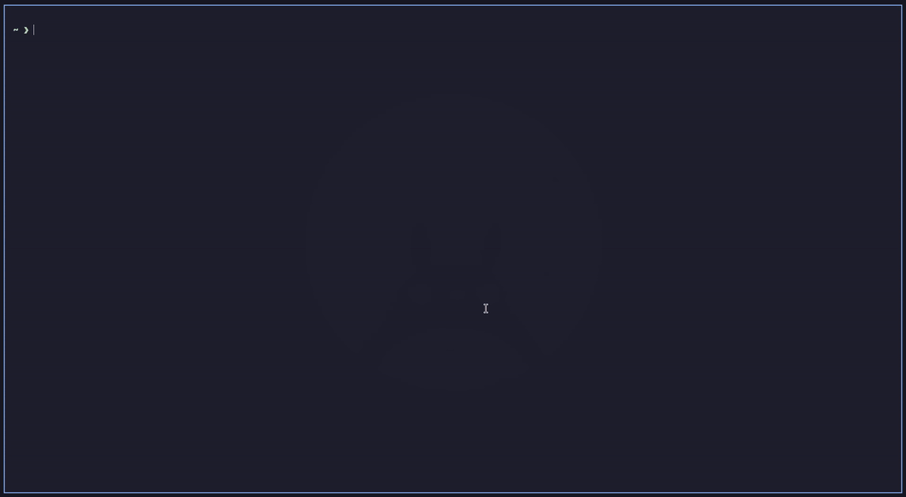

# auto-finder.nvim

A multi-view side panel for Neovim. One window hosts purpose-built
**views** — filesystem, git repos × worktrees, open buffers, an
autodb explorer, test/debug runners, and a prompt-style config REPL —
each reachable with a single keystroke.

Built on top of [`auto-core.nvim`](https://github.com/yongjohnlee80/auto-core.nvim)
(panel + state + event-bus primitives, bounded directory reads). The
files and buffers trees are in-house (ADR-0200); there is no neo-tree
code or dependency. The internal architecture is
documented in [`ARCHITECTURE.md`](./ARCHITECTURE.md); this README
is the user-facing surface.



<sub>One panel, one keystroke per view. The tour runs: **files** (tree
+ live filter) → **repos** (worktrees, commit history, per-commit file
lists) → full-width editing with the panel dismissed → **todos** (the
task store, expanded to a task's full frontmatter) → jumping straight
from a task to the ADR document it cites. The slot numbers you see
(`0: config  1: files  2: repos  3: dbase  4: todos  5: debug  6: tests`)
are a custom arrangement — slots are configurable per workspace, see
[`slot assign`](#what-ships).</sub>

## At a glance

```
┌─ auto-finder ──── [0: config] [1: files] [2: repos] · ────────────┐
│                                                                    │
│  (active view's buffer renders here)                               │
│                                                                    │
└────────────────────────────────────────────────────────────────────┘
```

- One panel, many views. Numeric `0..9` in normal mode switches
  views instantly.
- The active view is **persisted across nvim restarts** — the
  panel re-opens on the view you were last on.
- The panel is left-anchored with `winfixwidth` + `winfixbuf`
  protection — external `:edit` / `:buffer` / bufferline-click
  hijacks bounce off and the panel keeps its identity.
- Width is pinnable (`panel resize N`) as a hard cap; long
  filenames truncate at the pin instead of shoving the editor
  sideways.

## What ships

**Three views are in the default slot list** — the panel is useful
the moment you install it:

| # | View | Needs | What it shows · what it solves |
|--:|---|---|---|
| 0 | **config** | — | Prompt-style admin REPL. Switch views, resize the panel, toggle file filters, rearrange slots. Tab-completion + clickable winbar throughout. *Solves: no hunting through `opts` for a setting you want to change once.* |
| 1 | **files** | — | Filesystem tree. Lazy: a directory is read only when you expand it, watched only while it is expanded, and nothing runs while the panel is hidden. Git status colours on names, diagnostics signs, `/` search. See [Files view](#files-view). *Solves: the ordinary explorer job, without a second plugin — and without its cost on a large workspace.* |
| 2 | **repos** | [`worktree.nvim`](https://github.com/yongjohnlee80/worktree.nvim) | Git repos × worktrees, discovered automatically — no registry, no manual add. Expands to per-worktree changes, commit history and per-commit file lists, with in-panel git actions. See [Repos view](#repos-view). *Solves: juggling several repos and worktrees without leaving the editor.* |

Six more views ship in the box but aren't in the default slot
list — add them with `slot add <name>` from the config REPL (or
list them in `opts.sections`):

| View | Needs | What it shows · what it solves |
|---|---|---|
| **buffers** | — | Open-buffer list as a tree: the cwd, then terminals, then one bucket per outside location. Mirrors `:ls`, including unloaded buffers added via `:badd` or session restore. *Solves: `:ls` as a navigable tree.* |
| **marks** | — | nvim marks browser. *Solves: marks you set and then forgot.* |
| **todos** | — | The auto-core task store: one file per task, status by directory. Rows expand to a task's full frontmatter — assignee, priority, tags, and `adr:` / `review:` document refs you can open straight from the panel. See [Automation](#automation-todo-listautomated). *Solves: tracking work in the repo instead of a browser tab.* |
| **dbase** | [`autodb`](https://github.com/yongjohnlee80/autodb) **≥ v0.3.0** | autodb's database explorer, hosted in the panel — connections, workspaces, notes and script history. See [DBase view](#dbase-view--autodb-inside-the-panel). *Solves: querying a managed database without a second application.* |
| **tests** / **debug** | [`auto-run.nvim`](https://github.com/yongjohnlee80/auto-run.nvim) | The ADR-0048 pair: a discovered test tree with per-row status glyphs, and a debug view over entry points (edited in place; `launch.json` imports into them), live dap sessions and persisted breakpoints — both headed by the state a run will use (active worktree, env file, base, test config). See [Tests & Debug views](#tests--debug-views-auto-run). *Solves: running and debugging without a terminal round-trip.* |

**Every companion is optional and probed at runtime, never imported.**
auto-finder calls `pcall(require, …)` for autodb, auto-run and
worktree; when one is absent the view renders a one-line placeholder
and the rest of the panel is unaffected. Install auto-finder on its
own and **config, files, buffers, marks and todos work immediately** —
`auto-core.nvim` is the only hard dependency, and it carries the task
store that the todos view reads.

To **re-order** the slots rather than edit one at a time, use `slot
assign` — a walk over slots 1..9 that asks for a section type per
slot, showing the current occupant and refusing duplicates; an empty
entry ends the list and `<C-c>` cancels. `slot assign <t1> <t2> …`
does the same in one line. It exists because `slot modify` refuses a
type that already lives elsewhere, so it can never swap two slots;
`assign` replaces the whole list at once, making any permutation
legal. Slot 0 (config) is fixed. Arrangements are stored per
workspace and survive a restart.

Plus the foundations behind the views, all centralized in
`lua/auto-finder/core/`:

- **Translated topics** — views subscribe to `auto-finder.core.*`
  topics, never to auto-core directly; core owns every watch handle
  and drops events for directories nobody watches.
- **Re-armable lifecycle** — every subscription survives an
  `auto-core.events` bus reset (e.g. `:Lazy reload`) via
  unconditional dispose-first-then-resubscribe on
  `core.ensure_started`.
- **Centralized `fs.watch` + `git.watch` handle ownership** —
  the files view's non-recursive directory watches are refcounted
  by owner in `core/watchers.lua` and released when the panel hides.
- **Bounded work** — directory reads go through `auto-core.fs.scan`
  (single-flight per path, rate-limited, batched with yields), and a
  burst of file events re-reads each named directory once.

For the full structural picture — directory layout, module
responsibilities, system + event-flow mermaid diagrams,
auto-core dependency surface, and per-event-source detection +
processing — see [`ARCHITECTURE.md`](./ARCHITECTURE.md).

## Requirements

- **Neovim ≥ 0.10**
- [`auto-core.nvim`](https://github.com/yongjohnlee80/auto-core.nvim)
  — foundation library (panel singleton, state namespace, event bus,
  `fs.watch`, `fs.scan`, `git.watch`, `git.status`, centralized log,
  and the `fs.atomic` write primitive that auto-finder's persistence
  delegates to). **Hard dep**, `^0.2.30` (the release that carries
  `fs.scan` and `git.status.get_async`).
- [`nvim-tree/nvim-web-devicons`](https://github.com/nvim-tree/nvim-web-devicons)
  (or `mini.icons` with its devicons mock) — **optional**, recommended.
  Without it, directories and files get plain glyphs.
- `nui.nvim` and `plenary.nvim` are **no longer needed** — they were
  dependencies of the retired neo-tree fork. Remove them from your spec
  unless another plugin uses them. Upstream `neo-tree.nvim` no longer
  collides with auto-finder either.
- [`yongjohnlee80/worktree.nvim`](https://github.com/yongjohnlee80/worktree.nvim)
  `^0.5.0` — powers the **repos** view, which renders worktree.nvim's
  own explorer (commits, diffs, git actions). **Required for that
  view**: without it the repos slot reports the missing dependency
  once, loudly, and stays empty.
- [`yongjohnlee80/autodb`](https://github.com/yongjohnlee80/autodb)
  **`^0.3.0`** — soft dep for the **dbase** view. When absent, the
  view shows a placeholder explaining the dependency; the rest of
  the panel is unaffected.

  > **v0.3.0 is a hard floor, not a preference.** The dbase view
  > mounts autodb's own drawer module, `autodb.views.drawer`, which
  > only exists from autodb v0.3.0 — that release moved the drawer
  > UI out of auto-finder and into autodb. The availability gate
  > requires **both** halves:
  >
  > ```lua
  > if not pcall(require, "autodb.session") then return false end
  > return _drawer() ~= nil
  > ```
  >
  > On autodb ≤ v0.2.x the session half loads fine while the drawer
  > half is missing, so the panel reports *"no database backend
  > available: autodb is not installed"* even though autodb is
  > installed and working — login and workspace selection keep
  > working, because those go through `autodb.session`. If you see
  > that message with a healthy autodb, check your version pin
  > first: a `^0.2.0` caret refuses to cross into 0.3.x by design.
- [`yongjohnlee80/auto-run.nvim`](https://github.com/yongjohnlee80/auto-run.nvim)
  `^0.1.0` — soft dep for the **tests** and **debug** views
  (ADR-0048 Phase 3). When absent, both views render a
  one-line hint; the rest of the panel is unaffected. The
  debug view's session/breakpoint sections additionally use
  [`mfussenegger/nvim-dap`](https://github.com/mfussenegger/nvim-dap)
  when it is installed.

## Install (lazy.nvim)

```lua
{
  "yongjohnlee80/auto-finder.nvim",
  version = "^0.5.0",
  dependencies = {
    "yongjohnlee80/auto-core.nvim",       -- foundation; hard dep
    "yongjohnlee80/worktree.nvim",        -- repos view
    "nvim-tree/nvim-web-devicons",        -- optional: icons
    -- autodb and auto-run are NOT listed: the dbase / tests / debug views
    -- probe for them and degrade to a placeholder, so the panel works
    -- without either installed.
  },
  opts = {
    -- Width spec — pick ONE of `default` or `percentage`.
    --   `default`     fixed column count for the resting panel
    --   `percentage`  fraction of vim.o.columns, clamped to [min..max]
    -- `min` / `max` also bound `panel resize N`'s hard-cap pin.
    width = { default = 38, min = 25, max = 100 },

    default_section = 1,  -- 1 = files; 0 = config; etc.

    -- Views the panel hosts, in order. The order also defines
    -- the numeric index used by `0..9` and `:AutoFinderFocus N`.
    -- This is the default; add "buffers" / "dbase" / "marks" /
    -- "todos" / "tests" / "debug" here or via `slot add`.
    sections = { "config", "files", "repos" },

    -- Open the panel for `nvim .` style directory invocations.
    hijack_directories = true,

    -- The files view (see "Files view" below for every key).
    files = {
      follow = true,                           -- reveal the current file
      never_show = { ".git", "node_modules" }, -- replaces the default list
      auto_expand_width = true,                -- widen to fit, unless pinned
      mappings = {},                           -- { [lhs] = action | fn | false }
    },
  },
  keys = {
    { "<leader>e",  "<cmd>AutoFinder<cr>",        desc = "auto-finder: toggle panel" },
    { "<leader>E",  "<cmd>AutoFinder!<cr>",       desc = "auto-finder: toggle (force, ignores width-guard)" },
    { "<leader>fe", "<cmd>AutoFinderFocus 1<cr>", desc = "auto-finder: focus files view" },
  },
}
```

> **Caret pin (`^0.5.0`)**: future v0.5.x releases auto-include
> without a manual bump. The plugin holds an additive-only
> contract within a minor line — v0.5.x releases never rename,
> remove, or break-shape any existing public surface. v0.5.0
> itself was a breaking line (the neo-tree fork's retirement; see
> `CHANGELOG.md`), which is why it needed the caret moved.

That spec alone gives you **config, files, repos, buffers, marks and
todos**. Nothing else is required.

### Adding the companion plugins

The dbase, tests and debug views are powered by three separate
plugins. Install whichever you want as ordinary lazy specs — order
does not matter, and auto-finder picks them up on the next start.
Then make the view visible by listing it in `sections` (or run `slot
add <name>` once from the config REPL, which persists per workspace).

```lua
-- dbase view — a database explorer in the panel.
{
  "yongjohnlee80/autodb",
  version = "^0.3.0",   -- v0.3.0 is the floor: it owns `autodb.views.drawer`
  build = "make build", -- autodb ships a Go backend alongside the plugin
},

-- tests + debug views — test discovery, runners, dap integration.
{ "yongjohnlee80/auto-run.nvim", version = "^0.1.0" },

-- repos view — already in the dependencies list above, shown here
-- for completeness. Owns worktree switching / add / clone / init.
{ "yongjohnlee80/worktree.nvim" },
```

…and turn the views on:

```lua
opts = {
  sections = { "config", "files", "repos", "dbase", "todos", "debug", "tests" },
}
```

| Want | Install | Then |
|---|---|---|
| Database explorer | [`autodb`](https://github.com/yongjohnlee80/autodb) `^0.3.0` | add `"dbase"` to `sections` |
| Test tree + runner | [`auto-run.nvim`](https://github.com/yongjohnlee80/auto-run.nvim) | add `"tests"` to `sections` |
| Debug entry points, dap sessions, breakpoints | [`auto-run.nvim`](https://github.com/yongjohnlee80/auto-run.nvim) | add `"debug"` to `sections` |
| Repos × worktrees | [`worktree.nvim`](https://github.com/yongjohnlee80/worktree.nvim) | in `sections` by default |
| Task store | — (ships with `auto-core.nvim`) | add `"todos"` to `sections` |

If a view is listed in `sections` but its plugin is missing, the panel
still opens — that view just renders a placeholder naming what to
install. Nothing errors and no other view is affected.

### Using AutoVim instead

[AutoVim](https://github.com/yongjohnlee80/autovim) is a full Neovim
configuration that wires all of the above together with the pins
already matched, which is the arrangement shown in the demo above.
Installing auto-finder by hand as described here is fully supported —
AutoVim is a convenience, not a requirement.

## Commands

| Command                      | Effect                                                          |
|------------------------------|-----------------------------------------------------------------|
| `:AutoFinder[!]`             | Toggle the panel (`!` ignores width-guard)                      |
| `:AutoFinderFocus <N\|name>` | Switch to view N (e.g. `:AutoFinderFocus repos`)                |
| `:AutoFinderResize <N>`      | Pin panel width to N columns (hard cap)                         |
| `:AutoFinderReset`           | Clear the pin (back to dynamic width)                           |
| `:AutoFinderResumeDiff`      | Reopen the last repos diff at the file and line you left it on  |

## Config REPL cheatsheet

Inside the panel, press `0` to focus the config view. Type
`help` (or `?`) for the full list, or any of these:

```
focus 1                  # jump to files (numeric or name)
focus files              # same thing
focus repos              # jump to the repos × worktrees view
panel resize 50          # pin width to 50 cols (hard cap)
panel reset              # release the pin (alias: panel dynamic)
panel show               # show mode / default / range / live width
files show hidden        # include .gitignored files in the tree
files hide dotfiles      # hide .* files
files follow on          # follow the current buffer in the tree
repos follow on          # follow the current buffer's repo/worktree
slot add todos           # add a view to the slot list
slot assign files repos  # replace the whole slot list (any permutation)
status                   # panel + view state
reload                   # re-render the active view
clear                    # clear the REPL transcript
quit                     # close the panel (view buffers persist)
```

Tab-completion works on every verb, including numeric width
candidates inside the configured `[width.min .. width.max]`
range.

(Worktree *mutations* are owned by `worktree.nvim` — use its
`<leader>gw` / `<leader>gA` / `<leader>gC` / `<leader>gc`
keymaps to switch / add / clone / init worktrees. The repos
view renders what worktree.nvim tracks, and owns only the
per-row git actions listed below.)

## Files view

The tree reads a directory only when you expand it, and watches it only
while it is expanded and the panel is shown. Hiding the panel cancels
in-flight reads and releases every watch; showing it re-reads each
expanded directory once. Toggling `<leader>e` rapidly costs at most a
few reads per expanded directory, however fast you press it.

| Key | Action |
|---|---|
| `<CR>` / double-click | open the file (in the last editor window) or toggle the directory |
| `S` / `s` / `t` | open in a split / vertical split / new tab |
| `a` | add a file; end the name with `/` for a directory (missing parents are created) |
| `A` | add a directory |
| `d` | delete (confirmed; the root cannot be deleted) |
| `r` / `m` | rename / move (open buffers follow the file) |
| `y` / `x` / `p` | mark for copy / mark for cut / paste the marked items into the directory under the cursor |
| `/` / `<C-x>` | search as you type (basename glob, at most 50 results, shown as a tree) / clear the search |
| `H` | toggle gitignored entries (`auto-core.files` show_hidden) |
| `C` / `z` | collapse the directory / collapse all |
| `R` | re-read the expanded directories |
| `i` | file details: name, path, type, size, created, modified, git code |
| `?` | this list |

Keys the retired neo-tree pane had and this one drops: `P` preview (and
its `l` / `<C-f>` / `<C-b>`), `w` window picker, `O` expand-all, `o*` sort
orders, `D` fuzzy directory find, `#` fuzzy sorter, `f` filter-on-submit,
`.` / `<BS>` / `<` / `>` re-root and source switching, `b` rename
basename, `c` copy to a typed path, `<C-r>` clear marks, `e` toggle
auto-expand (now `files.auto_expand_width`). Remap a kept action, or bind
a function, with `files.mappings`:

```lua
files = { mappings = { ["<C-s>"] = "open_split", y = false } }
```

Colours: names take git status colours (added, modified, untracked, …),
dotfiles are dimmed, and every group is an `AutoFinder*` group that
links to the `NeoTree*` name colour schemes already style, so your
theme's file-tree colours keep applying.

## Repos view

With `worktree.nvim` `^0.5.0` installed, the repos view is a **pure
renderer over `worktree.repos`** — every byte of tree data arrives
through that API, and the view shells no git of its own for reads or
actions.

Every node is cached, so a **cache-preserving repaint** — cursor move,
focus change — costs zero git subprocesses. Git is paid on first expand
and after an explicit invalidation; toggling a watch (`w`) is one such
invalidation, dropping the repo and worktree caches so the next render
re-reads status and history.

(One narrow exception to "shells no git", and it is not tree data:
submitting a review resolves the reviewer identity with `git -C
<worktree> config user.name`. It is run per-worktree on purpose —
`user.name` is per-repository, so answering from Neovim's cwd would
attribute a review of one repo to another's configured identity.)

```
▾ repo
  ▾ worktree            ● watched
    ▾ UNCOMMITTED (n files)
        <changed file>
    ▾ <commit>
        <changed file>
        <review json>
  ▸ <collapsed worktree>
```

| Key    | Action                                            |
|--------|---------------------------------------------------|
| `<CR>` | Expand / open the row                             |
| `o`    | Diff this commit                                  |
| `O`    | Diff this worktree's branch against its base      |
| `w`    | Watch / unwatch this worktree                     |
| `m`    | Load more commits                                 |
| `i`    | Info for the row under the cursor                 |
| `R`    | Reload                                            |
| `f`    | Fetch this repository                             |
| `s`    | Stage / unstage this file                         |
| `c`    | Commit what is staged                             |
| `P`    | Push — **confirms first, naming the repository**  |
| `G`    | GetPR — fetch PR #n's branch into a worktree      |
| `N`    | CreatePR — open a PR for this worktree's branch   |
| `#`    | Associate this worktree with an existing PR       |
| `S`    | Submit this review entry's findings to its PR     |
| `d`    | Worktree: release it from its PR. Review: remove it |
| `A`    | Attach review feedback to an in-progress task     |
| `?`    | Help                                              |

`P` sits one key from `p` and a push is the only action here that
leaves the machine, so the confirmation names the repo it is about to
publish: a mistyped key on the wrong row cannot push.

Left the diff to go read a file? `:AutoFinderResumeDiff` reopens it at
the file and line you were on.

### Pull requests — the two things `G`, `N` and `S` need

`G`, `N` and `S` reach a forge. Neither prerequisite is visible from the
panel, so both are spelled out in `?` as well.

**1. A token.** There is no ambient default and nothing prompts for one:
until a credential profile is registered, every PR key fails. Register one
with `worktree.nvim`'s `:WorktreeAuth`, from any buffer:

```vim
:WorktreeAuth set github.com command pass show git/pat
:WorktreeAuth set github.com env GITHUB_TOKEN
:WorktreeAuth list            " profiles only — never the token
:WorktreeAuth clear github.com
```

`G`, `N` and `S` check for a token **before** they prompt, and the refusal
names the exact `:WorktreeAuth set …` line for that repo's host — you no longer
type a PR number (or a title *and* a body) into a request that cannot be sent.
`i` on a repo row reports which key is selected, its shape, and its
**readiness** — flagging `UNAVAILABLE` (with the reason) or `readiness unknown`
rather than implying a source works; `:WorktreeAuth status` answers the same
from any buffer. A gate refuses only when nothing is selected or the selected
source is *known* to be unusable; an unprobed command provider is allowed
through, because knowing would mean running it. Neither executes a provider, so
neither can trigger a passphrase prompt, and neither prints a secret.

The key is matched **slug → host → env**: a repo slug (`owner__name`, double
underscore) for one repository, a forge host (`github.com`) for every repo
there — the usual case — and failing both `$GITHUB_TOKEN`, only when the host
really is GitHub. Command providers are allowlisted (`pass`, `op`, `gh`,
`secret-tool`, `keyctl`, `security`), and the profile store holds the
*reference*, never the secret. Full detail lives in
[worktree.nvim's README](https://github.com/yongjohnlee80/worktree.nvim#forge-authentication-for-pr-features).

**2. An association.** The `[#N]` badge, `O`'s range diff and a review's `→ #N`
tag all read from one fact: a worktree is PR #N when its branch is named
`pr-<N>`, **or** when `prs/<slug>/pr-<N>.md` in the project's primary KB
(auto-core.kb) says `branch: <that branch>`. `G` and `N` both write that
document, so the ordinary flows need no manual step.

The ordering matters once: **a review inherits its PR from the worktree at
draft time.** Open the diff on a worktree that is not yet associated and the
review is written with no PR, so `S` can never submit it — fetch or create the
PR first, then review. To repoint an association by hand, edit that document's
`branch:` line; delete the document to dissociate the worktree. (`d` in the
panel dissociates a *review*, not a worktree.)

## DBase view — autodb inside the panel

The **dbase** view hosts [autodb](https://github.com/yongjohnlee80/autodb)'s
explorer in the panel: connections, workspaces, notes and script history, beside
your files and repos.

Since ADR-0078 the drawer itself **lives in autodb**, and this view is a thin
facade over it: auto-finder registers a host *provider* with autodb's drawer-host
registry and mounts the instance the registry hands back. The registry is the
sole constructor and sole disposer, which is what makes "at most one mounted
drawer" enforceable in one place — and it is what lets autodb show a drawer even
when auto-finder is not installed. What stays auto-finder's: the availability
gate, the placeholder screen, owned-buffer accounting, and teardown.

autodb is a **soft dependency and is not declared here**. The view probes for it
and, when it is absent, renders a short buffer saying so rather than failing —
the panel stays usable without a database backend installed.

**Requires autodb `^0.3.0`.** The view mounts autodb's own
`autodb.views.drawer`, which arrived in v0.3.0 when the drawer UI moved out of
auto-finder. On an older autodb the panel reports *"no database backend
available: autodb is not installed"* even when autodb is installed and
healthy — see [Requirements](#requirements) for why, and check your version
pin before anything else.

Keymaps inside the drawer are autodb's; press `?` there for its help. Connections,
users, roles and at-rest encryption belong to autodb's own backend, so there is
nothing to configure here and no connection file to protect — the view takes no
options.

### nvim-dbee has been removed

The dbase view mounted nvim-dbee's drawer from v0.2.16 through the 0.3 line.
**v0.4.0 removed it completely** — it is not a fallback and is not maintained.
Roughly 2450 lines went with it: the connection vault, its encrypted source and
crypto provider, the drawer setup owner, the companion editor/result/call_log
layout, the event bridge, and the `dbase` admin verb that managed connections.
autodb owns all of that on its own backend, so keeping a second copy inside a
file explorer made no sense.

If you were using the dbee-backed dbase view, your connections still live in
dbee's own store; move them into autodb (`<leader>Dc` in AutoVim, or the
standalone TUI). Nothing here reads them any more, and the `dbase …` REPL verbs
that managed them are gone.

One consequence worth stating plainly: schema-aware SQL completion went with
dbee. `cmp-dbee` hard-requires `dbee` and gates on `dbee.api.core.is_loaded()`,
so it cannot outlive it, and autodb does not ship a completion source yet.

## Tests & Debug views (auto-run)

Two flat scratch-buffer views (ADR-0048 Phase 3, simplified in ADR 0199)
over [`auto-run.nvim`](https://github.com/yongjohnlee80/auto-run.nvim)'s
public API — its discovery tree, config store, env files and breakpoint
persistence — refreshed by the `run.*` topics and by
`core.active_worktree:changed`. Register with `slot add tests` / `slot add
debug`. Needs auto-run **v0.1.15+** for the header and config management (an
older auto-run gets a one-line notice and the rest of the pane renders).

**Both panes open with a state header** — always shown, never collapsible —
stating what a run will use, every value from `auto-run.context` (the same
answers a run resolves, so the header cannot disagree with what executes):

| Row | Shows | Key |
|---|---|---|
| Active worktree | the directory auto-run works in, as `<repo>/<folder>` when a folder inside the repo was chosen, and its branch; "not a repository" when it is not one | `w` choose: the `<leader>gw` worktree list, then the worktree root, a project folder or a typed directory (auto-core's `choose_active`, also auto-run's `<leader>rw`; the cwd never changes) |
| Env | the env file applied to every launch; "(process env only)"; "— MISSING" | `s` choose |
| Base | the launch config merged under every run, debug and test; "(none)" | `b` choose |
| Test config *(tests pane)* | per runtime: the config that applies and why — `(picked)`, `(shared pick)`, `(first)` — and any remembered pick that does not apply | `c` choose |

Below it, an **Env** section lists the candidate `.env` files (referenced by
configs, or discovered under the worktree root and the bare-repo container at
`.`, `.config/`, `.vscode/`, `.auto-run/`); a `*` marks the selection.

### tests

A **Test configs** section (the store's `kind=test` configs: a `*` on the one
each runtime resolves to, with the reason; the shared per-kind pick as its own
row), then the discovered test-position tree (`dir → file → namespace → test`)
with per-row status glyphs from the last run (✓ passed · ✗ failed · ○ skipped
· ● running). Folder collapse persists across sessions. The tree header shows
the discovery root, counts, and the scan state — including auto-run's
structured cap report when a bounded full scan aborts.

| Key | Action |
|---|---|
| `<CR>` | jump to position (editor-routed); test config → open its file; env file → open; toggle collapse on a folder / section header |
| `r` | run position under cursor (test / file / namespace / folder = suite) |
| `R` | re-run the last position run from this panel |
| `d` | debug the test under cursor (dap strategy) |
| `o` | toggle details on a test row / env file (KEY=VALUE) / **test config** (its properties, like an entry point); collapse on containers |
| `O` | toggle ALL: collapse everything if anything is open, else expand everything |
| `i` | output float — the run's full terminal output (`go test` logs) |
| `s` | test config → pick it for its runtime (again: clear); shared-pick row → clear it; env file → select it; elsewhere → choose the env file |
| `w` / `b` / `c` | choose the active worktree / base / a runtime's test config |
| `a` | create a test config (runtime, name) — from any row outside the Env section; in the Env section → add KEY=VALUE to the file under the cursor (the selected file on the header) |
| `e` | property row → edit it in place (env values masked); env var → edit its value; test config → open its file |
| `D` | **delete** the test config or env variable under cursor — asks first, naming the file, its tier and whether git tracks it |
| `n` | new env file — defaults to `.auto-run/.env` (tracked with the repo); the worktree root, `.config/` or `.vscode/` also work |
| `S` | full worktree scan (bounded; `S` again cancels) |
| `x` | stop running test jobs |
| `?` | help overlay |

### debug

Sections: **Entry Points** (store configs `kind=debug|run`, grouped by kind,
provenance/tier annotated), **Env**, **Profiles** (env profiles, listed and
edited like entry points — choosing one is an entry point's `profile` row),
**Active Sessions** (live nvim-dap
sessions), and **Breakpoints** (the persisted per-repo store merged with live
dap state, grouped by file — orphaned persisted entries render dimmed).

An entry point owns its whole config. `o` fans it out into property rows —
program, args, cwd, build flags, runtime, env files, each env var, and for Rust
the Cargo identity — shown even when unset, and `e` on a row edits it in place
(prefilled; lists as one shell-split line; an empty answer clears). **Env values
stay masked**: the rows show keys and `${VAR}` / `cmd:` refs only, the prompt is
prefilled with `KEY=` alone, and a malformed answer is refused without echoing
it. A list edit lands exactly as typed — it replaces the inherited entries
rather than adding to them. `launch.json` is an import source (`I`), not a
live section.

The debug panel has **no delete surface** — breakpoints are managed via
nvim-dap directly (sign column / API); config files via the files panel.

| Key | Action |
|---|---|
| `<CR>` | entry point → open its **program source**; session → focus; breakpoint → jump; header → toggle collapse |
| `r` | entry point → **run** the program in an auto-agents playground terminal (prompts `term1`..`term4`) |
| `d` | entry point → **debug** (dap) |
| `o` | entry point → fan out its properties; session state / breakpoint condition; collapse on headers |
| `O` | toggle ALL sections open/closed |
| `e` | property row → edit in place; entry point / profile → open its file; env var → edit its value |
| `D` | **delete** the entry point, profile or env variable under cursor — asks first, naming each file, its tier and whether git tracks it; with a local layer over a tracked one you choose the local layer alone (the tracked one applies again) or both |
| `n` | new env file — defaults to `.auto-run/.env` (tracked with the repo); the worktree root, `.config/` or `.vscode/` also work |
| `a` | add an entry point (kind, runtime, name — auto-run scaffolds it); Profiles → add a profile; in the Env section → add KEY=VALUE to the file under the cursor (the selected file on the header) |
| `E` | export the entry point to `launch.json` (nearest reachable, else `<worktree>/.config/launch.json`) |
| `I` | import `launch.json` configurations into the store (one, or all; conflicts skipped and reported) |
| `s` | env file → select it; elsewhere → choose the env file |
| `w` / `b` | choose the active worktree / base |
| `x` | terminate the session under cursor |
| `p` | pause / continue the session under cursor |
| `i` | info popup for the row under cursor |
| `R` | refresh |
| `?` | help overlay |

## Architecture

auto-finder is layered:

- **Public API** (`lua/auto-finder/init.lua`) — `setup` /
  `open` / `close` / `toggle` / `focus` / `resize`.
- **`core/`** — runtime state component (8 modules). Owns
  every cache + watcher + subscription. Publishes
  `auto-finder.core.*` topics that views consume.
- **`views/`** — UI renderers (each a directory). Subscribe
  to translated topics. The files and buffers views share one
  renderer (`views/files/render.lua`, changed lines only); repos and
  dbase are pure renderers over `worktree.repos` and autodb's drawer.
- **`shared/`** — pure helpers (help overlay, debounce,
  window predicates, subscription sets).
- **`panel/`** — the window host. Implements
  `winfixwidth`/`winfixbuf` protection + the `with_unfixed_buf`
  primitive that internal swaps use, plus the config REPL's
  admin dispatcher.
- **`sections/`** — backwards-compat facade re-exporting
  `views/*` for any third-party caller pinned to the v0.1
  `require("auto-finder.sections.<name>")` shape.

The boundary with [`auto-core.nvim`](https://github.com/yongjohnlee80/auto-core.nvim)
is explicit and documented: auto-core owns OS-level watch
primitives, the events bus, the panel + section registry, the
log ring, and the state namespace. auto-finder layers the
domain-specific caches + views on top and never reaches into
auto-core internals.

For the full structural picture — mermaid diagrams,
per-event-source detection + processing walkthrough,
auto-core dependency surface, lifecycle, pointers for new
work — see [`ARCHITECTURE.md`](./ARCHITECTURE.md).

## Automation (`.todo-list/automated/`)

The todos view doubles as a scheduled-task engine: drop a
`status: automated` template under
`<workspace>/.todo-list/automated/<id>.md`, declare cron or
event conditions + an execute plan, and the engine clones it
into a fresh task on every condition match. Each clone goes
through the normal `open → in-progress → completed` lifecycle
so every fire leaves an audit trail.

Author templates with cron + event conditions, plain `bash` /
`bash -t=<N>` (floating-terminal-routed) / `assign agent:<name>`
execute primitives, a workspace-scoped bash trust gate, and
real-time `vim.diagnostic` validation as you type — full
how-to with examples, the cron grammar, the trust-gate flow,
debugging recipes, and the manual-fire / inspection commands
is in **[`AUTOMATION.md`](./AUTOMATION.md)**.

## Development

- **Run the whole suite with `tests/run-all.sh`.** Every standalone
  suite is wired into it, and each one ends by printing a canonical
  `N passed, M failed` summary line. A suite whose output lacks that
  line did not reach the end of its file — it aborted or crashed
  mid-run — and the runner counts it as FAILED rather than parsing
  whatever partial PASS lines it emitted. That sentinel is the only
  thing that can catch a C-level crash, so **running a single suite
  by hand is not a substitute**.
- Single suite, when you are iterating on one:
  `nvim --headless -u NONE -l tests/smoke.lua`.
- Suite → surface inventory:
  [`tests/auto-finder-coverage.md`](./tests/auto-finder-coverage.md).
- Per-phase failure / remediation audit log:
  [`tests/auto-finder-test-audit.md`](./tests/auto-finder-test-audit.md).
- Catalog of smoke sections removed during the ADR 0026
  refactor with reimplementation plans:
  [`tests/auto-finder-flaky.test.md`](./tests/auto-finder-flaky.test.md).
- Version policy: stays within the existing minor line
  (`v0.5.x`) until explicit approval to bump. See `CHANGELOG.md`
  for release-by-release notes.

### Continuous integration

`.github/workflows/ci.yml` runs two jobs, and the split between them is
the point.

**`lua` — the gate.** Every push to `main` and every pull request. It
installs a pinned toolchain and hands the verdict to `tests/run-all.sh`.
Everything is pinned, so a red run means *this change* rather than
something that moved underneath it:

| Pinned by | What | Why |
|---|---|---|
| commit SHA | `actions/checkout` | a tag can be moved to different code under the same name |
| version **and SHA-256** | Neovim `v0.12.5` | a release asset can be replaced under the same tag and name, so the version alone is not reproducible |
| commit SHA | `auto-core.nvim`, `worktree.nvim`, `auto-run.nvim`, `nvim-dap` | reproducibility; the pin's age is reported (see below) |
| commit SHA | `mini.icons`, `catppuccin` (via `AF_PARITY_DEPS`) | the parity gate compares against goldens captured with exactly these; see `tests/fixtures/parity/manifest.json` |

A runner's Neovim ships tree-sitter parsers for `c`, `lua`, `vim`,
`vimdoc`, `markdown` and `query` **only** — every other parser is something
a developer installed once and stopped seeing. So a suite that renders
tree-sitter output is green on every machine with a parser lying around and
red on the first runner without one. `.github/install-parsers.sh` builds
`go`, and only `go` from pinned grammar sources.
`smoke-adr0048` is the one suite here that builds a language
fixture, and it is a Go one; there are no JS/TS fixtures anywhere in this
tree, so auto-run's other three grammars are not this repo's dependency.

**`drift` — the early warning.** The same suite, with **auto-core resolved
at its default branch** instead of the commit `lua` pins. A regression in
auto-core reaches its consumers before anyone notices, and a consumer
pinned to a frozen auto-core is precisely the thing that cannot notice.
Both properties are wanted and they conflict, so they are split rather
than traded.

`drift` runs on a **schedule (Mondays, 06:00 UTC) and manual dispatch
only** — deliberately *not* on push or pull request. On push it would
redden the merge run for an upstream change unrelated to the PR being
merged, and would put a code path on the merge that no PR run exercised.

#### `tests/run-all.sh` is the whole verdict

CI does not reimplement the gate; it supplies the environment and lets the
runner be the judge. `run-all.sh` runs every suite and treats a **missing**
`N passed, M failed` summary line as a hard failure, rather than parsing
whatever partial PASS lines a suite emitted before it stopped. That
sentinel is the only thing that catches a C-level crash mid-run, which is
why running a single suite by hand is **not** a substitute:

```sh
./tests/run-all.sh                              # the gate
nvim --headless -u NONE -l tests/smoke.lua      # one suite, while iterating
```

#### A failing `drift` run has an addressee

A red row in the Actions tab is not a signal — nobody is obliged to open
it, and the one time a drift job caught a real regression in this family,
it was caught because somebody dispatched it by hand while investigating
something unrelated. Left to the schedule it would have gone red and sat
there. So on failure the job opens an **issue**, which has an addressee
that outlives a run's log retention and records *when* divergence started:

- **One issue per repo**, found by the **`ci-drift` label**, not by title.
  Title matching breaks the moment somebody edits the title — the next
  failure opens a duplicate instead of commenting.
- Reopened and commented rather than duplicated, so a month of Mondays is
  one thread instead of four issues nobody triages.
- **Closed automatically on the next green** drift run, with a comment
  saying the divergence cleared.

A `ci-drift` issue does **not** mean this plugin is broken for its users:
the gating job pins auto-core and is green. It means auto-core has moved in
a way this suite does not accept yet, and one of the two has to change
before the pin is bumped.

#### Exercising the notifier, and the pin's age

`workflow_dispatch` takes a **`force_drift_failure`** boolean that fails the
drift job deliberately:

```sh
gh workflow run ci.yml --repo yongjohnlee80/auto-finder.nvim --ref main \
  -f force_drift_failure=true
```

The whole premise of the notifier is that an unread signal is not a signal
— so an untested notifier is the same bug one layer up, and there has to be
a way to make it fire without waiting for auto-core to break something.

Proven here, both halves, on the real runner: a forced dispatch opened
[#33](https://github.com/yongjohnlee80/auto-finder.nvim/issues/33)
and the next green drift run closed it again.

The `lua` job also reports **how stale the auto-core pin is**, as routine
output rather than something discovered while debugging.
This repo's pin comment once read
`# main @ v0.2.15` while sitting eighteen commits and three releases
behind, and the way that surfaced was a cell failing on CI while passing
everywhere else.
It is
reported and never acted on: **bumping the pin is a deliberate, reviewed
change, never automatic.** A gating job that changes under a PR
reintroduces exactly the mystery failure on unrelated work that pinning was
adopted to prevent.

Two guards keep that report honest, and both exist because the first
version was wrong:

- It reads the compare API's **`ahead_by`**, not `behind_by`. For
  `compare/PIN...main`, `behind_by` is always `0` when the pin is an
  ancestor — the first version printed `0` on a pin eight commits stale,
  ran green, and would have called the pin current for as long as the repo
  existed. An unparseable answer now emits a `::warning` saying staleness
  was **not determined**, because `0` reads as "current".
- It **counts the `AUTO_CORE_REF` values in the file** and fails with
  `::error` if there is more than one. When this design was rolled out
  across the family, the step arrived carrying the pilot repo's SHA — every
  copy would have reported the age of a pin it does not use, in a step
  whose whole job is noticing staleness, with nothing about the copy
  looking wrong.
## License

MIT — © 2026 Yong Sung John Lee
